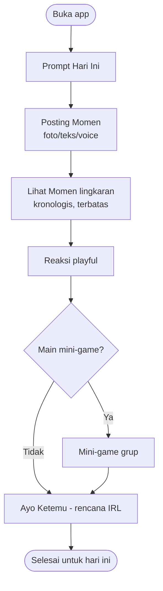

# 1. Fitur MVP (Tanpa AI) + Moderasi Manusia

[⬅️ Konsep](README.md) · [2. Indonesia & Latent Needs ➡️](02-indonesia-dan-latent-needs.md)

## Fitur inti MVP (semua non-AI, logika deterministik)
1. **Lingkaran (Circle)** — grup kecil, kapasitas dibatasi (mis. maks 15–20). Default **privat**.
2. **Prompt Hari Ini** — 1 ajakan ringan yang sama untuk semua ("Apa yang bikin kamu senyum hari ini?", "Foto langit dari tempatmu", "Lagu yang lagi diputar"). **Dikurasi manusia + usulan komunitas — bukan dibuat AI.**
3. **Momen** — jawaban atas prompt: foto apa adanya / teks pendek / voice note manusia. **Ephemeral** (hilang 24–48 jam), tanpa filter estetik wajib.
4. **Reaksi playful** — emoji, stiker, "tos", komentar singkat. Tanpa angka like publik.
5. **Mini-game grup** — turn-based sederhana: tebak-tebakan, "paling mungkin...", polling. Aturan deterministik, **bukan AI**.
6. **Ayo Ketemu** — papan rencana nongkrong IRL: waktu, tempat, RSVP. (Jembatan ke dunia nyata.)
7. **Streak & Kenangan** — rekap personal mingguan yang bikin hangat. Berguna walau lingkaran belum ramai.
8. **Verifikasi kampus (opsional)** — via email kampus, untuk mode komunitas kampus → identitas nyata, kurangi penyalahgunaan.

## Anti-fitur (SENGAJA tidak dibuat)
- ❌ **AI apa pun** — no chatbot, no AI feed/rekomendasi, no generasi konten, no moderasi AI.
- ❌ **Feed publik & infinite scroll** — isi lingkaran terbatas & selesai.
- ❌ **Follower / like publik** — anti adu pamer & perbandingan.
- ❌ **Algoritma manipulatif** — urutan **kronologis**; kamu yang pilih lingkaran.

## Moderasi TANPA AI
Karena kita menolak moderasi AI, keamanan bertumpu pada **desain sosial**:
1. **Lingkaran kecil + identitas kampus** → akuntabilitas sosial (bukan anonim massal).
2. **Pemilik lingkaran = moderator** lingkarannya.
3. **Ambassador / relawan kampus** untuk area komunitas.
4. **Tombol lapor → tinjauan manusia** (SLA jelas).
5. **Default privat** → permukaan serangan kecil.

> ⚖️ **Trade-off jujur:** moderasi manusia lebih lambat & mahal saat skala besar. Justru itu alasan **mulai kecil (1 kampus)** dan tumbuh terukur — bukan langsung "buat semua orang".

## Alur layar (MVP)

## "Bikin konten mudah" tanpa AI
Kebutuhan pasar "bikin konten gampang" tetap kita penuhi — **tanpa AI**:
- **Prompt harian** menghilangkan "bingung mau posting apa".
- **Template momen** sederhana (frame, stiker, teks) — manual, cepat.
- **Voice note & foto apa adanya** = effort rendah, keaslian tinggi.
