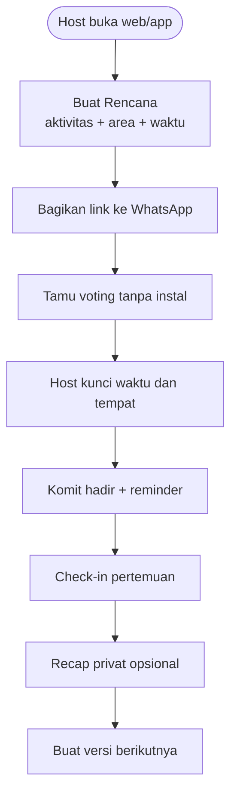

# 1. Fitur MVP + Moderasi Manusia

[⬅️ Konsep](README.md) · [2. Indonesia & Latent Needs ➡️](02-indonesia-dan-latent-needs.md)

## Fitur inti MVP (logika deterministik)

1. **Buat Rencana ≤30 detik** — aktivitas, area/tempat, dan 2–3 opsi waktu.
2. **Tautan tanpa instal** — host membagikan link ke WhatsApp; tamu tidak wajib punya akun untuk voting awal.
3. **Voting waktu** — peserta memilih opsi yang bisa dihadiri.
4. **Kunci rencana** — host menetapkan waktu/tempat dari hasil voting.
5. **RSVP / komit hadir** — status jelas, bukan chat yang tenggelam.
6. **Pengingat deterministik** — H-1 dan H-2 jam; aturan tetap.
7. **Check-in sederhana** — kode/tombol pertemuan untuk mengukur Rencana Jadi.
8. **Recap privat + ulang** — satu foto/kalimat opsional dan tombol “buat versi berikutnya”.

## Bukan bagian aktivasi MVP

Lingkaran permanen, Prompt Hari Ini, feed Momen, voice note, reaksi, mini-game, streak, Papan Kampus, dan verifikasi kampus ditunda sampai tes membuktikan bahwa Rencana benar-benar terjadi dan berulang.

## Anti-fitur (SENGAJA tidak dibuat)

- ❌ **Feed publik & infinite scroll** — MVP tidak membutuhkan feed.
- ❌ **Follower / like publik** — anti adu pamer & perbandingan.
- ❌ **Algoritma manipulatif** — urutan **kronologis**; kamu yang pilih lingkaran.

## Moderasi

Keamanan bertumpu pada **desain sosial**:

1. **Rencana privat berbasis undangan** → tidak ada discovery publik pada MVP.
2. **Host mengontrol daftar peserta** dan dapat menghapus tamu.
3. **Tautan dapat dirotasi/dinonaktifkan** jika tersebar di luar grup.
4. **Tombol lapor → tinjauan manusia** dengan SLA jelas.
5. **Data lokasi dibatasi** ke peserta yang diundang setelah rencana dikunci.

> ⚖️ **Trade-off jujur:** moderasi manusia lebih lambat & mahal saat skala besar. Justru itu alasan **mulai kecil (1 kampus)** dan tumbuh terukur — bukan langsung "buat semua orang".

## Alur layar (MVP)

## Mengapa bukan sekadar WhatsApp

Unggun tidak mengganti chat. Ia menang hanya jika lebih baik pada empat langkah: **mencari konsensus sebelum waktu ditetapkan, mengunci keputusan, mengukur komit hadir, dan memudahkan pengulangan setelah acara**. Bila eksperimen menunjukkan WhatsApp sudah cukup, tesis produk harus dihentikan.
