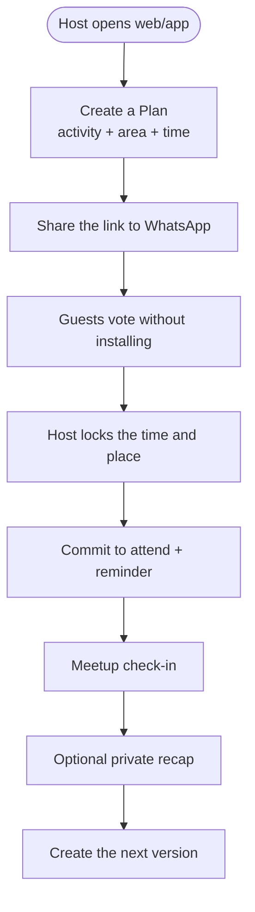

# 1. MVP Features + Human Moderation

[⬅️ Concept](README.md) · [2. Indonesia & Latent Needs ➡️](02-indonesia-and-latent-needs.md)

## Core MVP features (deterministic logic)

1. **Create a Plan in ≤30 seconds** — activity, area/place, and 2–3 time options.
2. **Install-free link** — the host shares a link to WhatsApp; guests don't need an account for the initial vote.
3. **Vote on times** — participants pick the options they can make.
4. **Lock the plan** — the host sets the time/place from the vote results.
5. **RSVP / commit to attend** — a clear status, not a chat that gets buried.
6. **Deterministic reminders** — 1 day and 2 hours before; fixed rules.
7. **Simple check-in** — a meetup code/button to measure Plans That Happen.
8. **Private recap + repeat** — one optional photo/sentence and a "create the next version" button.

## Not part of MVP activation

Permanent Circles, the Daily Prompt, the Moment feed, voice notes, reactions, mini-games, streaks, the Campus Board, and campus verification are deferred until testing proves that Plans truly happen and repeat.

## Anti-features (DELIBERATELY not built)

- ❌ **Public feed & infinite scroll** — the MVP doesn't need a feed.
- ❌ **Public followers / likes** — no showing off or comparison.
- ❌ **Manipulative algorithm** — **chronological** order; you choose your circle.

## Moderation

Safety rests on **social design**:

1. **Private, invitation-based Plans** → no public discovery in the MVP.
2. **The host controls the participant list** and can remove guests.
3. **Links can be rotated/disabled** if they spread beyond the group.
4. **Report button → human review** with a clear SLA.
5. **Location data is limited** to invited participants after the plan is locked.

> ⚖️ **An honest trade-off:** human moderation is slower and more expensive at large scale. That is exactly why we **start small (1 campus)** and grow in a measured way — rather than going straight to "for everyone".

## Screen flow (MVP)

## Why not just WhatsApp

Unggun doesn't replace chat. It wins only if it's better at four steps: **finding consensus before the time is set, locking the decision, measuring commitment to attend, and making it easy to repeat after the event**. If experiments show WhatsApp is already enough, the product thesis should be stopped.
