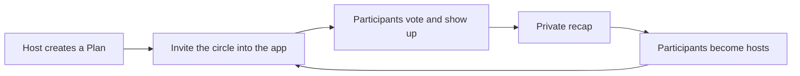
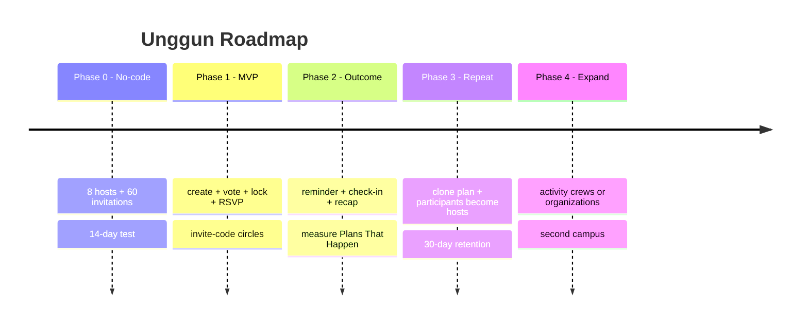

# 3. Growth, Metrics, Roadmap, Monetization (later)

[⬅️ 2. Indonesia & Latent Needs](02-indonesia-and-latent-needs.md) · [Concept](README.md)

> **Direction update (Aug 2026):** core is now **fun ephemeral group chat first**; meetups (and the "Plans That Happen" north-star below) are demoted to a phase-2 wedge. For the chat-first core, the working north-star is **rooms that get kept alive** — e.g. a healthy share of rooms reaching an **extend vote** and a lively **return rate** to active rooms — with "Plans That Happen" retained for when the meetup wedge ships. Canonical direction: [4. Rooms, lanes & design principles](04-rooms-and-lanes.md).

## North-star metric

Not raw DAU, but **Plans That Happen** = a plan with **≥3 participants who check in**.

Supporting metrics: host activation, vote response, ratio of plans carried out, attendance/RSVP, *repeat plan* at 14/30 days, and participant→host conversion.

## Growth loops

## Phased roadmap (growth-first, not monetization-first)

## Monetization (LATER — not now)

The focus right now = **find users**. Once it's sticky, options that **don't ruin the vibe**:

- Cosmetic circle customization (themes, stickers).
- Premium circle features (more capacity, Memories archive).
- **Event & campus** partnerships (not feed ads).
- ❌ No intrusive ads, ❌ no selling data.

## Risks & mitigations

| Risk | Mitigation |
| --- | --- |
| **A plain group chat is already enough** | Unggun must clearly beat chat at consensus + commitment; kill it if not |
| **Getting a whole circle to install** | Higher cold-start bar is the deliberate bet; make joining a ≤1-minute invite-code flow; measure activation ≥5/8 |
| **Plans get created but fall through** | Voting + lock + reminder; target ≥50% carried out |
| **Low retention** | Recap + clone; target repeat participant ≥30% |
| **Expensive manual moderation** | Private invitations, host control, human review |
| **Seen as less sophisticated** | Make *human-first* the campaign and the strength |
| **Chat-app incumbents** | Do one job (turning talk into real meetups) far better; don't try to be a chat app |

## The most concrete next steps

1. Run the [14-day no-app experiment](../validation/02-14-day-experiment.md).
2. Don't build a feed, prompts, mini-games, or a full account system during the test phase.
3. If GO, build a lightweight PWA for create/vote/lock/RSVP/check-in.
4. If ITERATE, focus on activity crews or campus organizations.
5. If KILL, stop the social-app thesis before building any further.
