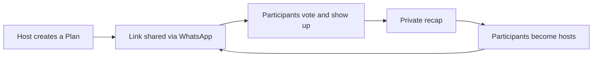
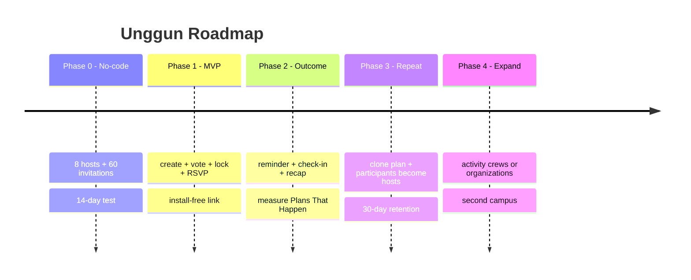

# 3. Growth, Metrics, Roadmap, Monetization (later)

[⬅️ 2. Indonesia & Latent Needs](02-indonesia-dan-latent-needs.md) · [Concept](README.md)

## North-star metric

Not raw DAU, but **Plans That Happen** = a plan with **≥3 participants who check in**.

Supporting metrics: host activation, vote response, ratio of plans carried out, attendance/RSVP, *repeat plan* at 14/30 days, and participant→host conversion.

## Growth loops

## Phased roadmap (growth-first, not monetization-first)

## Monetization (LATER — not now)

The focus right now = **find users**. Once it's sticky, options that **don't ruin the vibe**:

- Cosmetic circle customization (themes, stickers).
- Premium circle features (more capacity, Memories archive).
- **Event & campus** partnerships (not feed ads).
- ❌ No intrusive ads, ❌ no selling data.

## Risks & mitigations

| Risk | Mitigation |
| --- | --- |
| **WhatsApp is already enough** | The link must deliver consensus + commitment; kill it if not |
| **Hosts don't want to create a link** | ≤30-second form; measure activation ≥5/8 |
| **Plans get created but fall through** | Voting + lock + reminder; target ≥50% carried out |
| **Low retention** | Recap + clone; target repeat participant ≥30% |
| **Expensive manual moderation** | Private invitations, host control, human review |
| **Seen as less sophisticated** | Make *human-first* the campaign and the strength |
| **WhatsApp incumbent** | Complement it (moments + play together + meetups), don't replace chat |

## The most concrete next steps

1. Run the [14-day no-app experiment](../validation/02-eksperimen-14-hari.md).
2. Don't build a feed, prompts, mini-games, or a full account system during the test phase.
3. If GO, build a lightweight PWA for create/vote/lock/RSVP/check-in.
4. If ITERATE, focus on activity crews or campus organizations.
5. If KILL, stop the social-app thesis before building any further.
