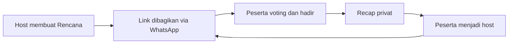
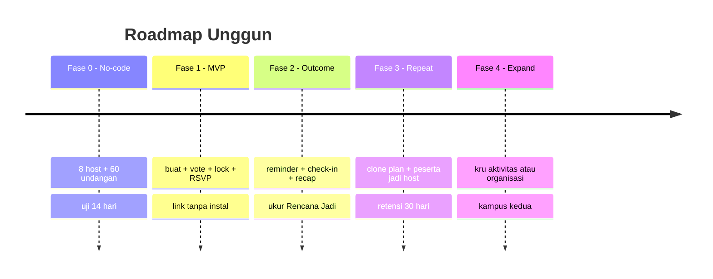

# 3. Growth, Metrik, Roadmap, Monetisasi (nanti)

[⬅️ 2. Indonesia & Latent Needs](02-indonesia-dan-latent-needs.md) · [Konsep](README.md)

## North-star metric

Bukan DAU mentah, tetapi **Rencana Jadi** = rencana dengan **≥3 peserta yang check-in**.

Metrik pendukung: aktivasi host, respons voting, rasio rencana terlaksana, kehadiran/RSVP, *repeat plan* 14/30 hari, dan konversi peserta→host.

## Growth loops

## Roadmap bertahap (growth-first, bukan monetisasi-first)

## Monetisasi (NANTI — bukan sekarang)

Fokus sekarang = **cari user**. Saat sudah lengket, opsi yang **tidak merusak vibe**:

- Kustomisasi kosmetik lingkaran (tema, stiker).
- Fitur premium lingkaran (kapasitas lebih, arsip Kenangan).
- Kemitraan **acara & kampus** (bukan iklan feed).
- ❌ Tanpa iklan yang mengganggu, ❌ tanpa jual data.

## Risiko & mitigasi

| Risiko | Mitigasi |
| --- | --- |
| **WhatsApp sudah cukup** | Link harus memberi consensus + commitment; kill jika tidak |
| **Host tidak mau membuat link** | Form ≤30 detik; ukur aktivasi ≥5/8 |
| **Rencana dibuat tetapi batal** | Voting + lock + reminder; target ≥50% terlaksana |
| **Retensi rendah** | Recap + clone; target repeat participant ≥30% |
| **Moderasi manual mahal** | Undangan privat, kontrol host, tinjauan manusia |
| **Dianggap kalah canggih** | Jadikan *human-first* sebagai kampanye & kekuatan |
| **WhatsApp incumbent** | Lengkapi (momen + main + janjian), jangan gantikan chat |

## Langkah paling konkret berikutnya

1. Jalankan [eksperimen 14 hari tanpa aplikasi](../validation/02-eksperimen-14-hari.md).
2. Jangan membuat feed, prompt, mini-game, atau sistem akun penuh selama fase tes.
3. Jika GO, buat PWA ringan untuk create/vote/lock/RSVP/check-in.
4. Jika ITERATE, fokus pada kru aktivitas atau organisasi kampus.
5. Jika KILL, hentikan tesis aplikasi sosial sebelum membangun lebih jauh.
