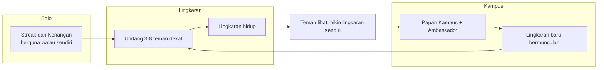
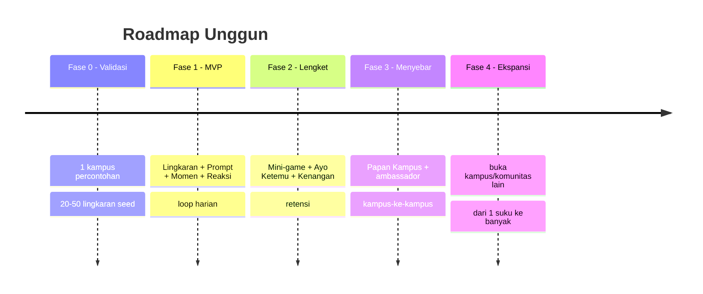

# 3. Growth, Metrik, Roadmap, Monetisasi (nanti)

[⬅️ 2. Indonesia & Latent Needs](02-indonesia-dan-latent-needs.md) · [Konsep](README.md)

## North-star metric
Bukan DAU mentah, tapi **Lingkaran Aktif Sehat** = lingkaran dengan **≥3 anggota** yang saling berbagi Momen **≥3 hari/minggu**. Sejalan dengan prinsip *social health* (kualitas koneksi, bukan waktu-layar).

Metrik pendukung: % undangan diterima, retensi minggu-4 per lingkaran, jumlah "Ayo Ketemu" yang benar-benar terjadi (IRL).

## Growth loops

## Roadmap bertahap (growth-first, bukan monetisasi-first)

## Monetisasi (NANTI — bukan sekarang)
Fokus sekarang = **cari user**. Saat sudah lengket, opsi yang **tidak merusak vibe**:
- Kustomisasi kosmetik lingkaran (tema, stiker).
- Fitur premium lingkaran (kapasitas lebih, arsip Kenangan).
- Kemitraan **acara & kampus** (bukan iklan feed).
- ❌ Tanpa iklan yang mengganggu, ❌ tanpa jual data.

## Risiko & mitigasi
| Risiko | Mitigasi |
|---|---|
| **Cold-start** (sepi di awal) | Mulai 1 kampus, seeding prompt, ambassador |
| **Retensi** (bukan cuma akuisisi) | Loop harian + streak + hook IRL |
| **Moderasi manual mahal** | Skala perlahan, identitas kampus, tombol lapor |
| **"Tanpa AI dianggap kalah canggih"** | Jadikan *human-first* sebagai kampanye & kekuatan |
| **WhatsApp incumbent** | Lengkapi (momen + main + janjian), jangan gantikan chat |

## Langkah paling konkret berikutnya
1. **Pilih 1 kampus** percontohan + 3–5 ambassador.
2. Susun **50 Prompt Harian** pertama (kurasi manusia).
3. Rakit **prototipe loop harian** (mulai dari clickable prototype).
4. Rekrut **10 lingkaran seed** (teman-temanmu) untuk uji 2 minggu.
