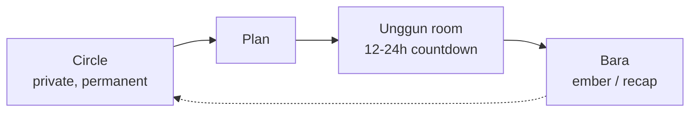

# 4. Rooms, Lanes & Design Principles (latest direction)

[⬅️ 3. Growth & Roadmap](03-growth-metrics-roadmap.md) · [Concept](README.md)

> This document consolidates the latest direction (Aug 2026) on top of docs 1–3: **ephemeral rooms**, **two social lanes**, **invite links**, and the **lean / privacy / safety** principles a 2-person team must hold. Treat the *serendipity lane* (Daily Unggun) as experimental/phase-2; the trusted-circle core is the committed base.

## The campfire lifecycle

Unggun's core object isn't a permanent feed — it's a fire that lights, glows, and fades:

- **Circle** — your small, private, *permanent* home (the friends you chose).
- **Plan** — "let's actually do X" → lights an Unggun.
- **Unggun (room)** — a temporary space **alive for 12–24h** with a visible **countdown**; where the moments, chat, polls, and play happen.
- **Bara (ember)** — when it fades, the chat is deleted but **3–5 saved highlights** remain as a private keepsake/recap.

Why ephemeral wins: urgency/FOMO (be here now), low commitment, **self-cleaning** (no graveyard of dead groups), and — crucial for our budget — **bounded storage** (a room and its media auto-expire, so storage never piles up).

## Invite links & the openness dial

A room can be joined three ways — the host picks:

- 🔒 **Private** — invite your Circle only (default).
- 🔗 **Invite link / code** — a clickable link (or code) so friends can join.
- 🏫 **Scoped** — open within one context (a campus, an interest) — "public" but bounded.

**Consistency rule (self-contained):** an invite link brings people *into* Unggun to join a room — **it does not move the conversation out** to a chat app. You may *share* the link through WhatsApp or anywhere (that's just distribution), but the plan, voting, chat, and recap all stay inside Unggun.
Guardrails so a leaked link can't flood a room: links are **revocable + expiring + size-capped**, with optional **host approval**.

## Two lanes (keep them separate)

| | 🏠 Trusted Circles (core) | 🎲 Daily Unggun (serendipity) |
| --- | --- | --- |
| Who | Friends you chose | Scoped-random people (same campus/interest) |
| Purpose | Real plans that happen | Meet new-ish people, the fun of the day |
| Openness | Private | Semi-open, opt-in |
| Risk | Low | Higher (needs safety rails) |
| Phase | Now (committed) | Phase 2 (experimental) |

Keeping them separate means the risky discovery lane can never poison the trusted core — and if serendipity turns out messy, the core still stands.

## Daily Unggun + rotating host (the serendipity idea, made safe)

The spark of the idea — *"each day you get dropped into a room, and people take turns hosting"* — is strong: a daily surprise (ritual/anticipation hook), meeting new people, and shared ownership. Two changes make it safe enough for a 2-person, human-moderated app:

1. **Scope the randomness.** Match people within a **shared context** (same campus, an interest they opted into, friends-of-friends) around a **daily hook/prompt** — not global strangers, and never an empty room. Random *within a context* = serendipity without stranger-danger.
2. **Host = "your turn to light tonight's room", not police powers.** Hosting is an **opt-in** invitation with **light duties** (kick it off, pick the prompt, keep it warm). Heavier actions (removing someone) are simple, rate-limited, and always backed by **report → the two founders**. We do **not** hand a random stranger unilateral power over other strangers.

Rooms stay **small (≤~12–20) + ephemeral (24h)**, so a random room feels like a dinner party, not a mob.

## Design principles a 2-person team must hold

**Lean by design (cheap on purpose).**

- Small circles cap fan-out (a photo is seen by ≤12, not thousands); ephemerality caps storage → the whole thing is cheap *by architecture*.
- Media on **Cloudflare R2** (zero egress fees, 10 GB free) via direct presigned uploads; compress on-device before upload.
- **Defer video** (the one budget-killer); if ever, keep it tiny + ephemeral + post-revenue.
- Use a BaaS (**Supabase**/Firebase: Postgres + Auth + Realtime + Storage) so two people skip server ops.

**Privacy by design (less to distrust).**

- No real name / address / DOB / precise GPS. Identity = a **handle + emoji avatar**.
- **Location is typed by the user** as free text; **check-in is a code/button, not GPS** → no location permission at all.
- Invite by **code/link, not contact-book upload**; sign in with an **email magic link**, not SMS OTP.

**Human moderation.**

- Report → the two founders review; block; size caps; **no anonymity** (handle identity); scope the openness. Small + private by default keeps the load low.

## Phasing

1. **Now (core):** Circles → Plans → ephemeral rooms → Bara; invite links; the lean + privacy foundations. Prove *plans actually happen* first (see the [14-day experiment](../validation/02-14-day-experiment.md)).
2. **Phase 2 (experimental):** the Daily Unggun serendipity lane + rotating host — switched on once the core has users and a working report→review muscle.

## Honest risks

- **Strangers + a 2-person mod team** → scope the randomness, no anonymity, size caps, rate-limited actions, report→founders, and gate stranger-matching (e.g., campus/age) before opening wide.
- **Empty room at expiry** → always anchor a room to a plan/hook so there's a reason and people.
- **Fun but shallow** (the BeReal lesson) → Bara + the plans wedge are the retention floor.
