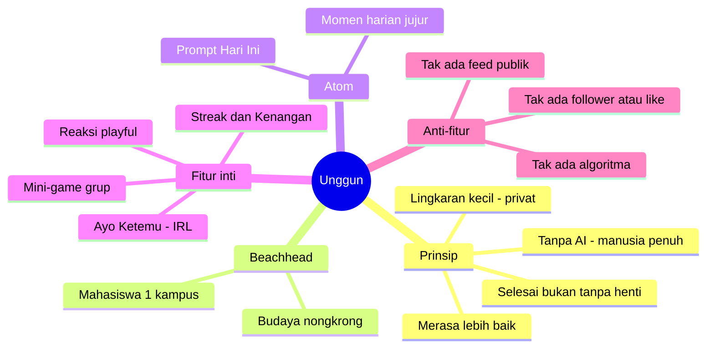
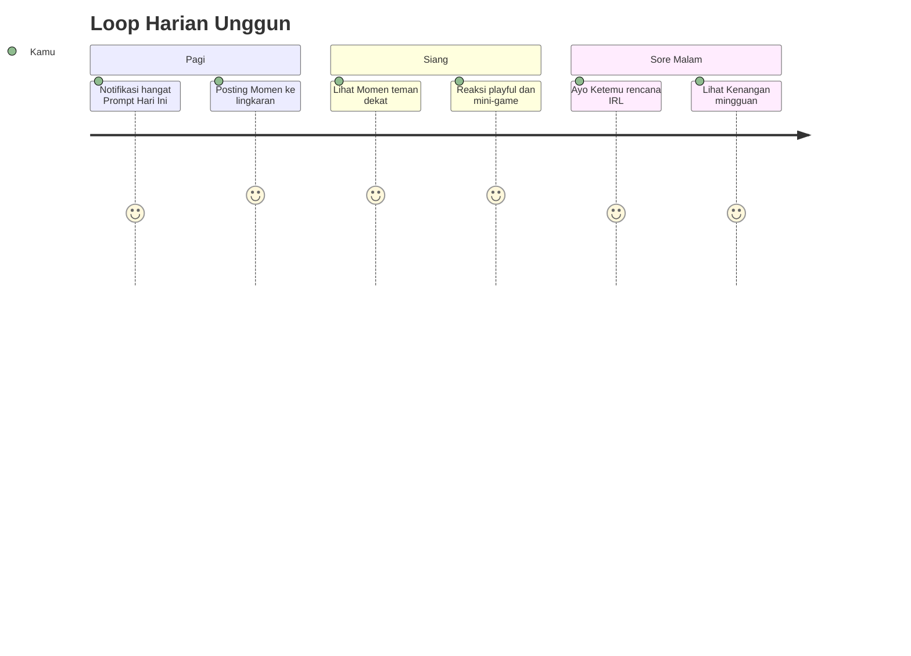
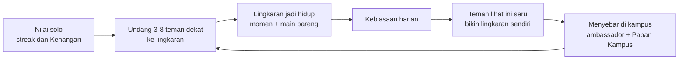

# 🔥 Konsep Produk: "Unggun" — nongkrong online tanpa AI

> Nama kerja: **Unggun** (dari *api unggun*). Alternatif: **Bara**, **Riung**, **Kumpul**.
> Status: konsep v1 — turunan langsung dari [riset](../research/README.md).

## Manifesto (positioning)
**Unggun = ruang tamu, bukan panggung.** Tempat lingkaran kecil teman dekat berbagi momen jujur, main bareng, dan janjian ketemu — hangat, santai, dan **100% manusia**.

- 🚫 **Tanpa AI.** Tidak ada chatbot, konten buatan mesin, feed/rekomendasi AI, atau moderasi AI. Semua dari & untuk manusia.
- 🔒 **Lingkaran kecil, bukan siaran publik.** Default privat.
- ⏹️ **Selesai, bukan tanpa henti.** Tidak ada *infinite scroll*; tiap hari ada awal & akhir.
- 😌 **Bikin merasa lebih dekat & lebih baik**, bukan lebih insecure. Tak ada adu follower/like.

> **Kenapa "tanpa AI" justru kekuatan?** Riset menunjukkan orang **lelah, cemas, & rindu keaslian** (lihat [latent needs](../research/03-latent-needs.md)). Di tengah banjir "AI slop", **human-first** adalah diferensiasi yang jujur dan langka.

## Inti konsep dalam 3 pertanyaan
| Pertanyaan | Jawaban Unggun |
|---|---|
| **Atom** (unit inti) | **Momen** — 1 potret jujur harian (foto apa adanya / teks pendek / voice note) sebagai jawaban "Prompt Hari Ini". Ephemeral 24–48 jam. |
| **Komunitas pertama** (beachhead) | **Mahasiswa (terutama maba) di 1 kampus** Indonesia — padat, muda, mobile-first, budaya nongkrong kuat. |
| **Kenapa balik tiap hari** | **Loop harian yang hangat & selesai**: prompt → momen → reaksi teman → main bareng → janjian ketemu. |

## Daily loop

## Growth loop

## Peta dokumen konsep
1. [Fitur MVP (tanpa AI) + moderasi manusia](01-fitur-mvp-tanpa-ai.md)
2. [Beachhead Indonesia + pemetaan latent needs](02-indonesia-dan-latent-needs.md)
3. [Growth, metrik, roadmap, monetisasi-nanti](03-growth-metrik-roadmap.md)

> ✍️ Ini **proposal** — beachhead & atom bisa diganti. Kalau kamu lebih dekat ke komunitas hobi tertentu (bukan kampus), tinggal bilang; pola & fiturnya sama.
