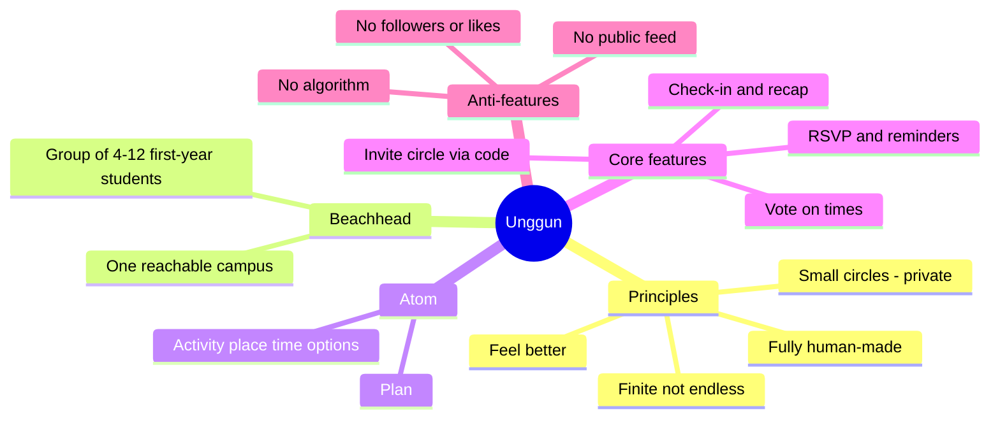
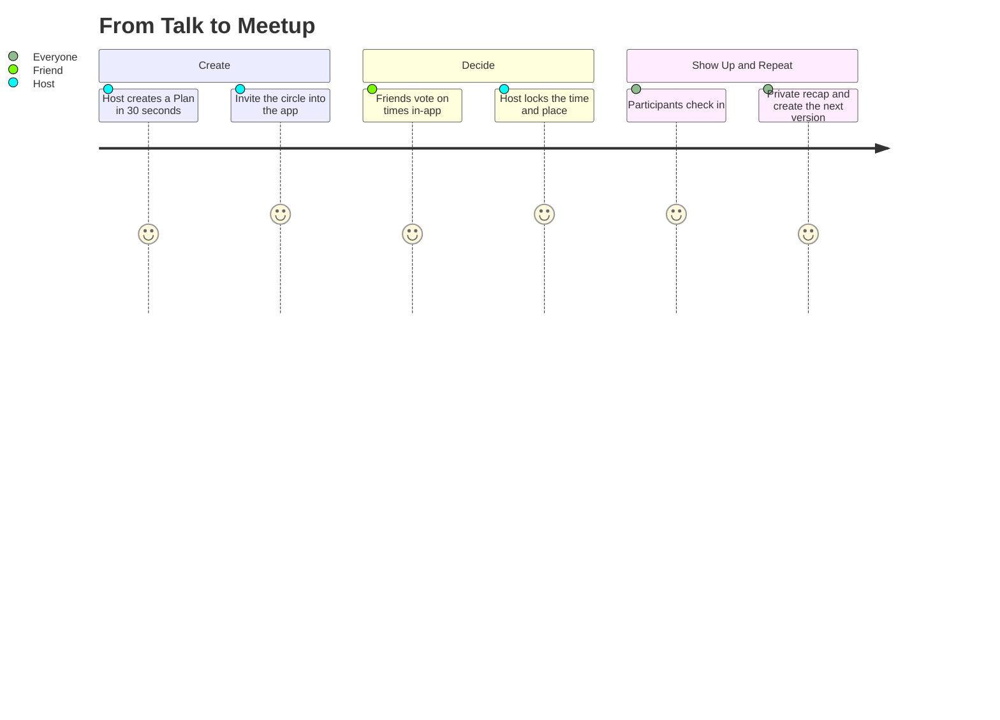
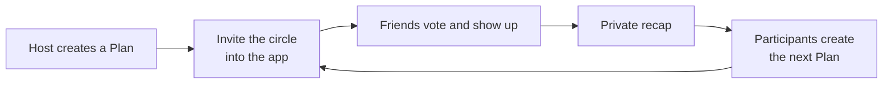

# Product Concept: Unggun v2 — make plans happen

> Working name: **Unggun** (from *campfire*). Alternatives: **Bara**, **Riung**, **Kumpul**.
> Status: **conditional pivot** after [GPT-5.6 Sol validation](../validation/01-gpt-5.6-sol-validation.md). Not ready to be fully built until the [14-day experiment](../validation/02-14-day-experiment.md) passes.

## Manifesto (positioning)

**Unggun helps small groups stop saying "someday" and actually meet up.** The host creates a plan, friends pick a time, everyone commits, then keeps a private recap — warm, lightweight, and **100% human-made**.

- 🔒 **Private plans, not public broadcasts.** The host invites the people who matter.
- 🔗 **Everything in one app.** Invite your circle in, then vote, RSVP, and keep recaps all inside Unggun — no plans lost in a group chat.
- ⏹️ **Finite, not endless.** No *infinite scroll* or obligation to post every day.
- 🤝 **Success = people actually show up**, not screen time, followers, or likes.

## Core concept in 3 questions

| Question | Unggun's answer |
| --- | --- |
| **Atom** (core unit) | **Plan** — activity + area/place + 2–3 time options + list of people. |
| **First community** (beachhead) | A group of **4–12 first-year students** on a single campus the founder can reach, who already try to arrange meals, study sessions, workouts, or hangouts in their group chats. |
| **Why they come back** | The next plan is easier to create, participants can become hosts, and every meetup has a private recap. The rhythm is event-driven, not forced daily. |

## Plan loop

## Growth loop

## Concept document map

1. [MVP features + human moderation](01-mvp-features.md)
2. [Indonesia beachhead + latent needs mapping](02-indonesia-and-latent-needs.md)
3. [Growth, metrics, roadmap, monetization-later](03-growth-metrics-roadmap.md)
4. [Independent validation & concept comparison](../validation/README.md)

> This is the best current hypothesis, not the truth. Build the MVP only if the [GO](../validation/02-14-day-experiment.md#go) threshold is met.
