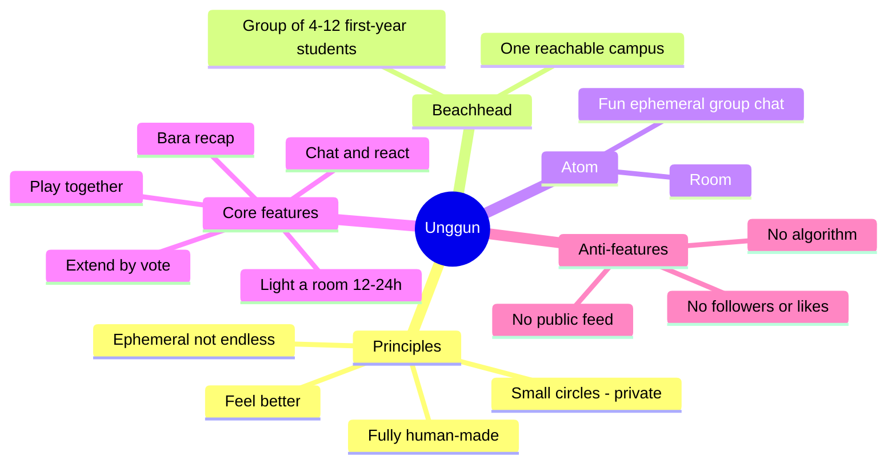
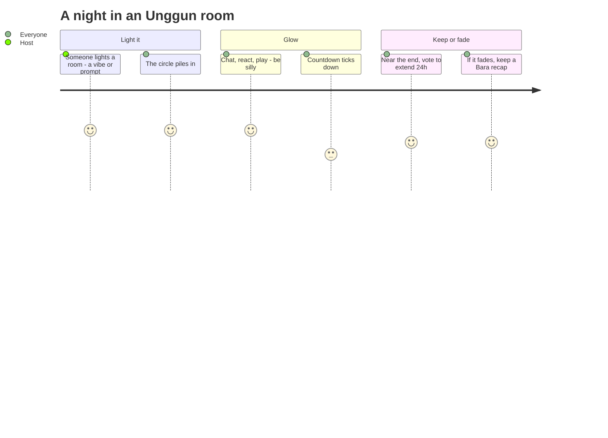
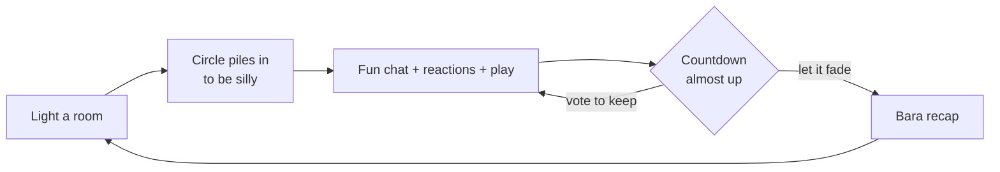

# Product Concept: Unggun — fun rooms that don't last forever

> Working name: **Unggun** (from *campfire*). Alternatives: **Bara**, **Riung**, **Kumpul**.
> Status (Aug 2026): **direction = a fun, ephemeral group chat first.** Real-life meetups ("Plans") are demoted to a later, mid-game add-on. The canonical current direction is [4. Rooms, lanes & design principles](04-rooms-and-lanes.md); docs 1–3 predate this pivot and are kept as background. Not ready to fully build until the [validation](../validation/README.md) gate is met.

## Manifesto (positioning)

**Unggun is a fun, low-stakes group chat for your small circle — in rooms that don't last forever.** You light a room, everyone piles in to be silly for a night, and when the countdown ends the chat fades — leaving only a few saved highlights (a *Bara*). If the circle loves a room, they can **vote to keep the fire going** for another 24h.

- 🔥 **Ephemeral by default.** A room glows for 12–24h, then fades — no endless backlog, no pressure to keep up.
- 🗳️ **Kept alive together.** Near the end, the room can vote to *extend* — the fun continues only if the circle wants it.
- 🔒 **Small & private.** Your chosen people, not a public audience. No followers, no public likes.
- 🤝 **100% human-made.** No algorithmic feed deciding what you see or say.

## Core concept in 3 questions

| Question | Unggun's answer |
| --- | --- |
| **Atom** (core unit) | **Room** — a fun, ephemeral group chat (12–24h countdown) for a small circle, kept alive only by an **extend vote**. |
| **First community** (beachhead) | A group of **4–12 first-year students** on one reachable campus who already have a lively group chat and want a livelier, lower-stakes place to just be themselves. |
| **Why they come back** | The room is fun *and* finite (FOMO + no backlog to catch up on), the circle keeps beloved rooms alive by vote, and every room leaves a warm *Bara* recap. Meeting up IRL is a later add-on, not the core. |

## Room loop

## Growth loop

## Concept document map

- 4. **[Rooms, lanes & design principles](04-rooms-and-lanes.md) — the canonical current direction (chat-first + extend-by-vote). Start here.**
- Background (predate the Aug 2026 chat-first pivot; still useful):
  - 1. [MVP features + human moderation](01-mvp-features.md) — now the phase-2 meetup wedge + the moderation model.
  - 2. [Indonesia beachhead + latent needs mapping](02-indonesia-and-latent-needs.md)
  - 3. [Growth, metrics, roadmap, monetization-later](03-growth-metrics-roadmap.md)
  - 5. [Independent validation & concept comparison](../validation/README.md) — validated the meetup framing; the chat-first core needs its own light validation.

> This is the best current hypothesis, not the truth. The prototype in [`prototype/`](../prototype/index.html) demonstrates the chat-first room + extend-by-vote loop.
