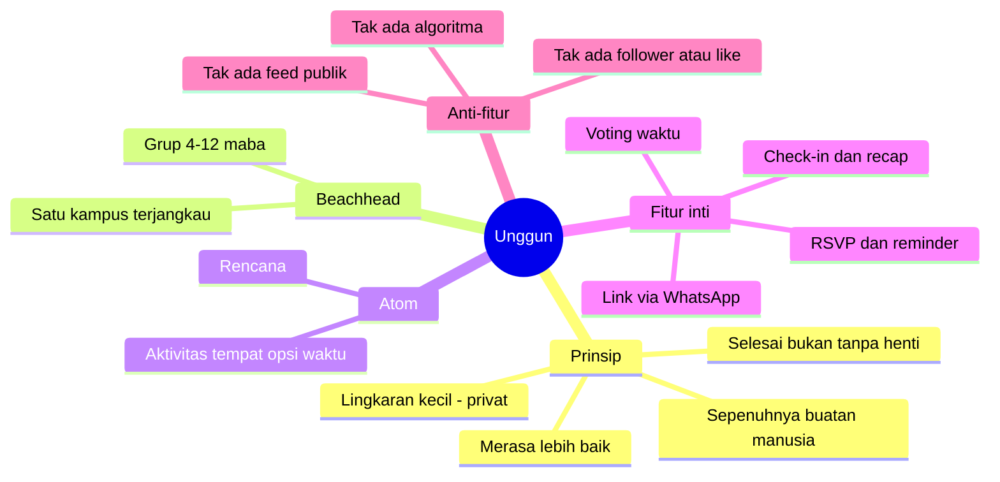
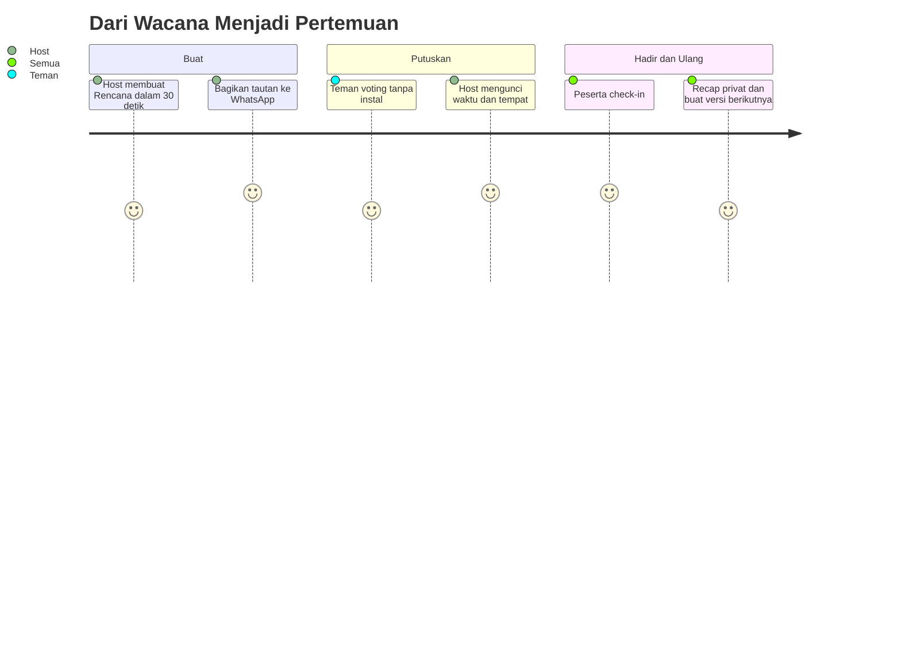
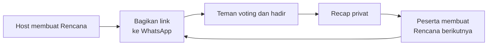

# Konsep Produk: Unggun v2 — bikin rencana jadi

> Nama kerja: **Unggun** (dari *api unggun*). Alternatif: **Bara**, **Riung**, **Kumpul**.
> Status: **pivot bersyarat** setelah [validasi GPT-5.6 Sol](../validation/01-gpt-5.6-sol-validation.md). Belum layak dibangun penuh sebelum [eksperimen 14 hari](../validation/02-eksperimen-14-hari.md) lulus.

## Manifesto (positioning)

**Unggun membantu grup kecil berhenti berkata “kapan-kapan” dan benar-benar bertemu.** Host membuat rencana, teman memilih waktu, semua berkomitmen, lalu menyimpan recap privat — hangat, ringan, dan **100% manusia**.

- 🔒 **Rencana privat, bukan siaran publik.** Host mengundang orang yang relevan.
- 🔗 **Bekerja lewat WhatsApp.** Tamu bisa voting dan RSVP dari tautan tanpa wajib instal.
- ⏹️ **Selesai, bukan tanpa henti.** Tidak ada *infinite scroll* atau kewajiban posting harian.
- 🤝 **Keberhasilan = orang benar-benar hadir**, bukan waktu layar, follower, atau like.

## Inti konsep dalam 3 pertanyaan

| Pertanyaan | Jawaban Unggun |
| --- | --- |
| **Atom** (unit inti) | **Rencana** — aktivitas + area/tempat + 2–3 opsi waktu + daftar orang. |
| **Komunitas pertama** (beachhead) | Grup **4–12 maba** di satu kampus yang dapat dijangkau founder dan sudah mengatur makan, belajar, olahraga, atau nongkrong lewat WhatsApp. |
| **Kenapa kembali** | Rencana berikutnya lebih mudah dibuat, peserta bisa menjadi host, dan setiap pertemuan punya recap privat. Ritmenya event-driven, bukan dipaksa harian. |

## Loop Rencana

## Growth loop

## Peta dokumen konsep

1. [Fitur MVP + moderasi manusia](01-fitur-mvp.md)
2. [Beachhead Indonesia + pemetaan latent needs](02-indonesia-dan-latent-needs.md)
3. [Growth, metrik, roadmap, monetisasi-nanti](03-growth-metrik-roadmap.md)
4. [Validasi independen & perbandingan konsep](../validation/README.md)

> Ini hipotesis terbaik saat ini, bukan kebenaran. Bangun MVP hanya jika ambang [GO](../validation/02-eksperimen-14-hari.md#go) tercapai.
