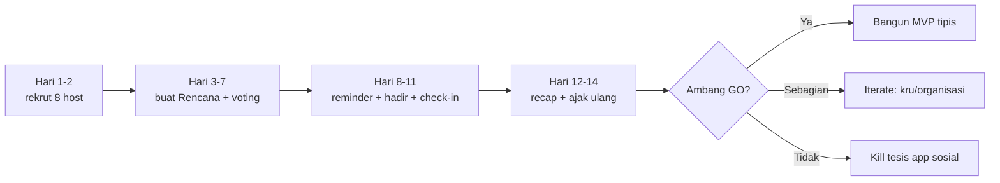

# Experiment Kit — Uji 14 Hari (Tanpa Kode, Tanpa AI)

Perkakas **siap-pakai** untuk menjalankan [eksperimen 14 hari](../validation/02-eksperimen-14-hari.md) yang menjadi gerbang **GO** sebelum membangun aplikasi Unggun v2.

> Prinsip: **tidak menulis kode, tidak memakai AI.** Semua lewat WhatsApp + 2 form kecil (Tally/Google Forms) + 1 spreadsheet.

## Kenapa ini "pilihan terbaik" sekarang

Validasi GPT-5.6 Sol menempatkan **membangun prototipe/aplikasi sebagai langkah SETELAH permintaan terbukti**. Cara termurah dan tercepat untuk tahu apakah ide ini nyata adalah **menguji apakah rencana benar-benar terjadi** — bukan bikin app dulu. Kalau lolos, kita bangun. Kalau gagal, kita hemat berminggu-minggu koding.

## Satu-satunya yang harus KAMU putuskan

Pilih **1 komunitas padat yang bisa kamu jangkau langsung**:

- kampus / angkatan / kelas / UKM tempat kamu berada, **atau**
- komunitas hobi (lari, buku, band, game) yang kamu ikut aktif.

Sisanya (skrip, form, template, tracker) sudah disiapkan di kit ini dan berlaku untuk komunitas mana pun.

## Isi kit

1. [Rekrutmen 8 host](01-rekrutmen-host.md)
2. [Buat & voting Rencana](02-buat-dan-voting-rencana.md)
3. [Template WhatsApp siap salin](03-template-whatsapp.md)
4. [Tracker & dashboard GO/ITERATE/KILL](04-tracker.md) + [CSV](tracker-template.csv)

## Alur 14 hari (ringkas)

## Ambang lulus (ringkas)

| Metrik | PASS |
| --- | ---: |
| Aktivasi host | >= 5 dari 8 |
| Respons voting/RSVP | >= 40% |
| Rencana jadi | >= 50% |
| Kehadiran | >= 60% RSVP "ya" |
| Repeat participant | >= 30% |
| Peserta -> host organik | >= 25% |

Detail rumus dan keputusan ada di [tracker](04-tracker.md).
