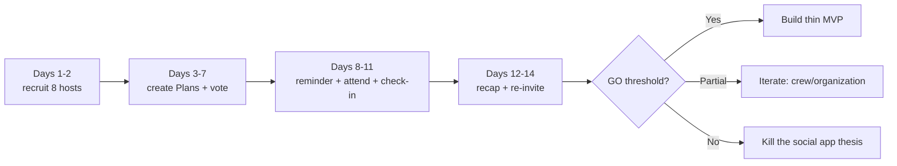

# Experiment Kit — 14-Day Test (No Code)

A **ready-to-use** toolkit for running the [14-day experiment](../validation/02-14-day-experiment.md) that serves as the **GO** gate before building the Unggun v2 app.

> Principle: **no writing code.** Everything runs through the crew's group chat + 2 small forms (Tally/Google Forms) + 1 spreadsheet.

## Why this is the "best choice" right now

The GPT-5.6 Sol validation places **building the prototype/app as the step AFTER demand is proven**. The cheapest and fastest way to know whether this idea is real is to **test whether plans actually happen** — not to build the app first. If it passes, we build. If it fails, we save weeks of coding.

## The only thing YOU need to decide

Pick **1 tight-knit community you can reach directly**:

- the campus / cohort / class / student club you belong to, **or**
- a hobby community (running, books, band, games) you're actively part of.

Everything else (scripts, forms, templates, tracker) is already prepared in this kit and works for any community.

## Kit contents

1. [Recruit 8 hosts](01-host-recruitment.md)
2. [Create & vote on Plans](02-create-and-vote-plans.md)
3. [Ready-to-copy message templates](03-message-templates.md)
4. [Tracker & GO/ITERATE/KILL dashboard](04-tracker.md) + [CSV](tracker-template.csv)

## 14-day flow (summary)

## Passing thresholds (summary)

| Metric | PASS |
| --- | ---: |
| Host activation | >= 5 of 8 |
| Vote/RSVP response | >= 40% |
| Plans that happen | >= 50% |
| Attendance | >= 60% of "yes" RSVPs |
| Repeat participant | >= 30% |
| Participant -> organic host | >= 25% |

Formula details and decisions are in the [tracker](04-tracker.md).
