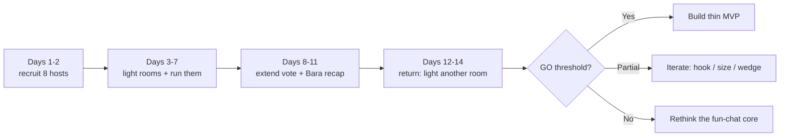

# Experiment Kit — 14-Day Test (No Code)

A **ready-to-use** toolkit for running the [14-day experiment](../validation/02-14-day-experiment.md) that serves as the **GO** gate before building the Unggun app.

> Principle: **no writing code.** Everything runs through a throwaway group chat (as a stand-in "room") + its built-in poll + 1 spreadsheet.

## Why this is the "best choice" right now

Building the app is the step **AFTER** people prove they love the thing. The cheapest, fastest way to know whether a **fun ephemeral room** is real is to **run a few by hand** — light a room, let a circle be silly, see if they vote to keep it alive and come back for more — not to build the app first. If it passes, we build. If it fails, we save weeks of coding.

## The only thing YOU need to decide

Pick **1 tight-knit community you can reach directly**:

- the campus / cohort / class / student club you belong to, **or**
- a hobby community (running, books, band, games) you're actively part of.

Everything else (scripts, forms, templates, tracker) is already prepared in this kit and works for any community.

## Kit contents

1. [Recruit 8 hosts](01-host-recruitment.md)
2. [Light & run a room (+ extend vote)](02-create-and-vote-plans.md)
3. [Ready-to-copy message templates](03-message-templates.md)
4. [Tracker & GO/ITERATE/KILL dashboard](04-tracker.md) + [CSV](tracker-template.csv)

## 14-day flow (summary)

## Passing thresholds (summary)

| Metric | PASS |
| --- | ---: |
| Room activation | >= 5 of 8 |
| Participation | >= 50% post at least once |
| Lively room | >= 50% of rooms |
| Extend pull | >= 30% of rooms kept alive |
| Return within 48h | >= 40% of circles |
| Participant -> organic host | >= 25% |

Formula details and decisions are in the [tracker](04-tracker.md).
