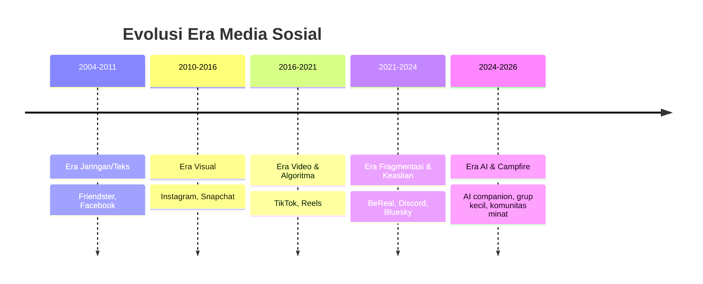

# 1. Lanskap & Data (2026)

[⬅️ Indeks](README.md) · Lanjut: [2. Keinginan Sekarang ➡️](02-keinginan-sekarang.md)

## 1a. Global
- ~**5,24 miliar** identitas pengguna sosmed; rata-rata **~2,5 jam/hari** — lebih dari sepertiga total waktu online.
- Feb 2025: **94,4%** pengguna internet 16+ membuka jejaring sosial — **melebihi** yang membuka mesin pencari (82,3%). "Social search" naik: **44% Gen Z** & **33% milenial** mencari info produk **terutama** dari sosmed.
- **Krisis atensi:** fokus rata-rata di perangkat turun ke **~47 detik** (dulu ~2,5 menit); Gen Z lepas fokus dari iklan dalam **~1,3 detik**. Video >60 detik dianggap "stressful"; **11–17 detik** paling optimal.
- **Keaslian** jadi mata uang: minat "social media authenticity" **+225%**; nano-influencer (1K–10K) punya **engagement tertinggi (~4%)**.
- **Sinyal lelah:** tren *social detox*, *digital minimalism*, penjualan *dumb phone* naik; peringatan **US Surgeon General (2023)** soal sosmed & kesehatan mental remaja.

## 1b. Amerika Serikat (Pew, 20 Nov 2025) — usia menentukan
| Platform | 18–29 | 30–49 | 50–64 | 65+ |
|---|---|---|---|---|
| YouTube | 95% | 92% | 85% | 64% |
| Instagram | **80%** | 62% | 40% | 19% |
| TikTok | **63%** | 44% | 30% | 12% |
| Snapchat | **58%** | 31% | 13% | 4% |
| Reddit | **48%** | 35% | 16% | 6% |
| Facebook | 68% | 80% | 74% | 57% |

➡️ Anak muda memadati platform **visual, video pendek, & komunitas**; Facebook "menua".

## 1c. Indonesia (Digital 2024, We Are Social × Meltwater) — pasar utamamu
- **185,3 jt** pengguna internet (~66,5%); koneksi seluler **353,3 jt (126,8%** populasi — sangat *mobile*).
- **~6 jam 3 menit/hari** di HP: hiburan ~2j9m, sosmed ~1j44m, game ~49m.
- Pemakaian platform: **WhatsApp 90,9%**, **Instagram 85,3%**, **Facebook 81,6%**, **TikTok 73,5%**; YouTube reach ~**139 jt**.
- Waktu/bulan: **TikTok ~38j**, YouTube ~31j, WhatsApp ~26j. WhatsApp dibuka **~1.347×/bulan (≈4× TikTok)**.
- Alasan pakai: **hiburan 58,9%**, **kontak 57,1%**, **lihat yang dibahas 48,8%**.

➡️ Karakter Indonesia: **mobile-first, hiburan-first, messaging-first, creator-led**.

## Sumber
- Pew Research Center (2025); Exploding Topics / DataReportal Digital 2025; Meltwater × We Are Social, *Digital Indonesia 2024*.
