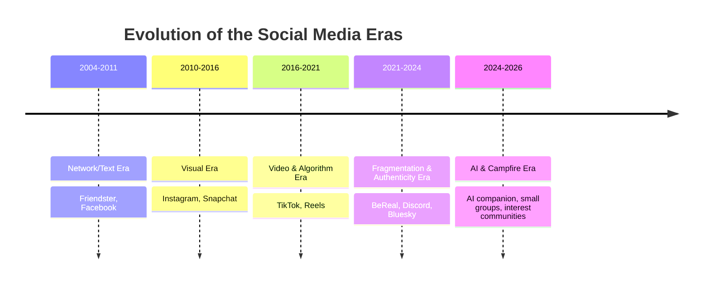

# 1. Landscape & Data (2026)

[⬅️ Index](README.md) · Next: [2. What People Want Now ➡️](02-keinginan-sekarang.md)

## 1a. Global

- ~**5.24 billion** social-media user identities; on average **~2.5 hours/day** — more than a third of total time online.
- Feb 2025: **94.4%** of internet users aged 16+ opened a social network — **more than** those who opened a search engine (82.3%). "Social search" is rising: **44% of Gen Z** & **33% of millennials** look up product info **primarily** on social media.
- **Attention crisis:** average focus on a device has dropped to **~47 seconds** (previously ~2.5 minutes); Gen Z loses focus on an ad within **~1.3 seconds**. Videos over 60 seconds are seen as "stressful"; **11–17 seconds** is most optimal.
- **Authenticity** has become currency: interest in "social media authenticity" is **+225%**; nano-influencers (1K–10K) have the **highest engagement (~4%)**.
- **Fatigue signals:** trends of *social detox*, *digital minimalism*, and rising *dumb phone* sales; the **US Surgeon General (2023)** warning about social media & teen mental health.

## 1b. United States (Pew, 20 Nov 2025) — age decides

| Platform | 18–29 | 30–49 | 50–64 | 65+ |
| --- | --- | --- | --- | --- |
| YouTube | 95% | 92% | 85% | 64% |
| Instagram | **80%** | 62% | 40% | 19% |
| TikTok | **63%** | 44% | 30% | 12% |
| Snapchat | **58%** | 31% | 13% | 4% |
| Reddit | **48%** | 35% | 16% | 6% |
| Facebook | 68% | 80% | 74% | 57% |

➡️ Young people crowd into **visual, short-video, & community** platforms; Facebook is "aging".

## 1c. Indonesia (Digital 2026 + APJII 2024) — your primary market

- DataReportal estimates **230M individuals** used the internet as of October 2025 (**80.5%** penetration) and recorded **331M active mobile connections** (**116%** of the population).
- DataReportal counts **180M active social-media user identities** (**62.9%** of the population); **78.2%** of the internet-user base uses at least one social platform. Identity figures are not always the same as unique people.
- The median age of Indonesia's population is **30.4 years**, so the market remains relatively young.
- *Ad-planning tools* estimate Instagram's reach at **108M** and TikTok's at **180M users aged 18+**. These are ad-reach estimates, **not verified MAU**, and must not be compared directly across platforms.
- As a methodological comparison, the APJII 2024 face-to-face survey (8,720 respondents, 38 provinces, *margin of error* 1.1%) estimates **221.6M internet users**, or **79.5%** penetration; Gen Z makes up the largest group (**34.4%**).
- The Digital 2024 behavioral baseline still shows **mobile-first, entertainment-first, and messaging-first** patterns, but the 2024 duration/app-usage figures are not treated as current 2026 numbers.

> **Methodology note:** DataReportal warns that large changes in the number of social identities can stem from source-data corrections and deduplication methods, not just real behavioral change. APJII and DataReportal also use different methods and measurement dates.

➡️ A reasonably strong conclusion: Indonesia is **young, highly connected, and mobile-first**. The conclusion that users definitely want a particular product still has to be tested directly.

## Sources

- [Pew Research Center — Social Media Fact Sheet](https://www.pewresearch.org/internet/fact-sheet/social-media/) (2025).
- [DataReportal — Digital 2026: Indonesia](https://datareportal.com/reports/digital-2026-indonesia).
- [APJII — Jumlah Pengguna Internet Indonesia Tembus 221 Juta Orang](https://apjii.or.id/berita/d/apjii-jumlah-pengguna-internet-indonesia-tembus-221-juta-orang) (7 Feb 2024).
- [Meltwater × We Are Social — Digital Indonesia 2024](https://www.meltwater.com/en/blog/social-media-statistics-indonesia) (historical baseline).
