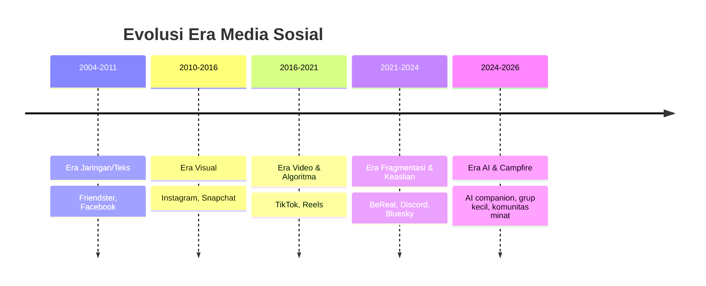

# 1. Lanskap & Data (2026)

[⬅️ Indeks](README.md) · Lanjut: [2. Keinginan Sekarang ➡️](02-keinginan-sekarang.md)

## 1a. Global

- ~**5,24 miliar** identitas pengguna sosmed; rata-rata **~2,5 jam/hari** — lebih dari sepertiga total waktu online.
- Feb 2025: **94,4%** pengguna internet 16+ membuka jejaring sosial — **melebihi** yang membuka mesin pencari (82,3%). "Social search" naik: **44% Gen Z** & **33% milenial** mencari info produk **terutama** dari sosmed.
- **Krisis atensi:** fokus rata-rata di perangkat turun ke **~47 detik** (dulu ~2,5 menit); Gen Z lepas fokus dari iklan dalam **~1,3 detik**. Video >60 detik dianggap "stressful"; **11–17 detik** paling optimal.
- **Keaslian** jadi mata uang: minat "social media authenticity" **+225%**; nano-influencer (1K–10K) punya **engagement tertinggi (~4%)**.
- **Sinyal lelah:** tren *social detox*, *digital minimalism*, penjualan *dumb phone* naik; peringatan **US Surgeon General (2023)** soal sosmed & kesehatan mental remaja.

## 1b. Amerika Serikat (Pew, 20 Nov 2025) — usia menentukan

| Platform | 18–29 | 30–49 | 50–64 | 65+ |
| --- | --- | --- | --- | --- |
| YouTube | 95% | 92% | 85% | 64% |
| Instagram | **80%** | 62% | 40% | 19% |
| TikTok | **63%** | 44% | 30% | 12% |
| Snapchat | **58%** | 31% | 13% | 4% |
| Reddit | **48%** | 35% | 16% | 6% |
| Facebook | 68% | 80% | 74% | 57% |

➡️ Anak muda memadati platform **visual, video pendek, & komunitas**; Facebook "menua".

## 1c. Indonesia (Digital 2026 + APJII 2024) — pasar utamamu

- DataReportal memperkirakan **230 jt individu** memakai internet pada Oktober 2025 (**80,5%** penetrasi) dan mencatat **331 jt koneksi seluler aktif** (**116%** populasi).
- DataReportal mencatat **180 jt identitas pengguna media sosial aktif** (**62,9%** populasi); **78,2%** basis pengguna internet memakai sedikitnya satu platform sosial. Angka identitas tidak selalu sama dengan orang unik.
- Median usia penduduk Indonesia **30,4 tahun**, sehingga pasar tetap relatif muda.
- *Ad-planning tools* memperkirakan jangkauan Instagram **108 jt** dan TikTok **180 jt pengguna usia 18+**. Ini adalah estimasi jangkauan iklan, **bukan MAU terverifikasi**, dan tidak boleh dibandingkan langsung antarplatform.
- Sebagai pembanding metodologis, survei tatap muka APJII 2024 (8.720 responden, 38 provinsi, *margin of error* 1,1%) memperkirakan **221,6 jt pengguna internet** atau **79,5%** penetrasi; Gen Z menyumbang kelompok terbesar (**34,4%**).
- Baseline perilaku Digital 2024 tetap menunjukkan pola **mobile-first, hiburan-first, dan messaging-first**, tetapi angka durasi/pemakaian aplikasi 2024 tidak diperlakukan sebagai angka terkini 2026.

> **Catatan metodologi:** DataReportal memperingatkan bahwa perubahan besar jumlah identitas sosial dapat berasal dari koreksi data sumber dan metode deduplikasi, bukan hanya perubahan perilaku nyata. APJII dan DataReportal juga memakai metode serta tanggal pengukuran berbeda.

➡️ Kesimpulan yang cukup kuat: Indonesia **muda, sangat terkoneksi, dan mobile-first**. Kesimpulan bahwa pengguna pasti menginginkan produk tertentu masih harus diuji secara langsung.

## Sumber

- [Pew Research Center — Social Media Fact Sheet](https://www.pewresearch.org/internet/fact-sheet/social-media/) (2025).
- [DataReportal — Digital 2026: Indonesia](https://datareportal.com/reports/digital-2026-indonesia).
- [APJII — Jumlah Pengguna Internet Indonesia Tembus 221 Juta Orang](https://apjii.or.id/berita/d/apjii-jumlah-pengguna-internet-indonesia-tembus-221-juta-orang) (7 Feb 2024).
- [Meltwater × We Are Social — Digital Indonesia 2024](https://www.meltwater.com/en/blog/social-media-statistics-indonesia) (baseline historis).
