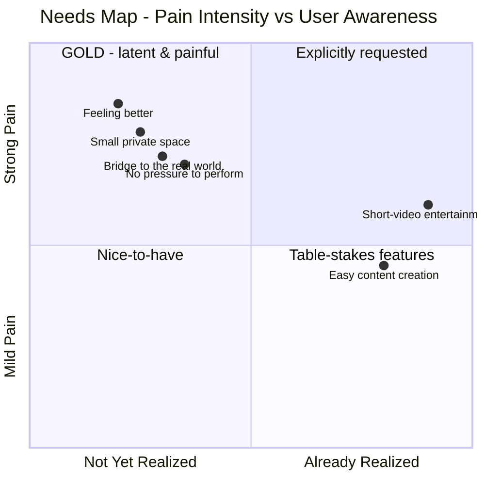

# 3. What People NEED but Don't Yet Realize (LATENT NEEDS)

[⬅️ 2. Wants](02-current-wants.md) · [Index](README.md) · [4. Opportunity ➡️](04-whitespace-opportunities.md)

The most important part: things people **feel the pain of**, but don't yet know there's a product for.

| # | Latent need | The "pain" felt | Evidence / signal |
| --- | --- | --- | --- |
| 1 | **Feeling better** after scrolling (*social health*) | Open the app → feel more insecure/anxious | Detox trend, dumb phone, Surgeon General 2023; Bluesky praised as "Shangri-La" |
| 2 | **A small & private space** (*digital campfire*) | Tired of "performing" on a public stage | HBR "Antisocial Social Media" (2020); group chats; Fizz (campus) |
| 3 | **A bridge to the real world** | Thousands of followers but lonely | Partiful (events), Jagat (location, 10M+ in SEA) |
| 4 | **Being seen without the pressure to be perfect** | Afraid to post because it has to be "aesthetic" | BeReal, Dispo (retro camera), Made With Friends |
| 5 | **Companionship & being heard without judgment** | Need to vent/have a friend anytime | Character.ai 3.5M/day, mostly 16–30 ⚠️ |
| 6 | **Self-expression & identity** | Generic profiles that feel "not me" | Noplace (MySpace nostalgia, customization) |
| 7 | **Control over the algorithm** | Feeling "controlled" by the feed | Bluesky: pick your own algorithm, anti-toxicity, no ads |
| 8 | **Finding "my people"** | Hard to find a like-minded community | Reddit/Discord/RedNote (interest > follow) |
| 9 | **Time that matters** (anti-doomscroll) | Regret after 2 hours of scrolling | The "time well spent" movement |

> ⚠️ **Warning on #5 (AI companion):** demand is huge, but Character.ai faces **serious lawsuits & a ban on users under 18 (Nov 2025)** over safety.
>
> **Our product stance:** we answer the "companionship & being heard" need with **real human connection** (a circle of close friends) — see [`../concept/02-indonesia-and-latent-needs.md`](../concept/02-indonesia-and-latent-needs.md).

