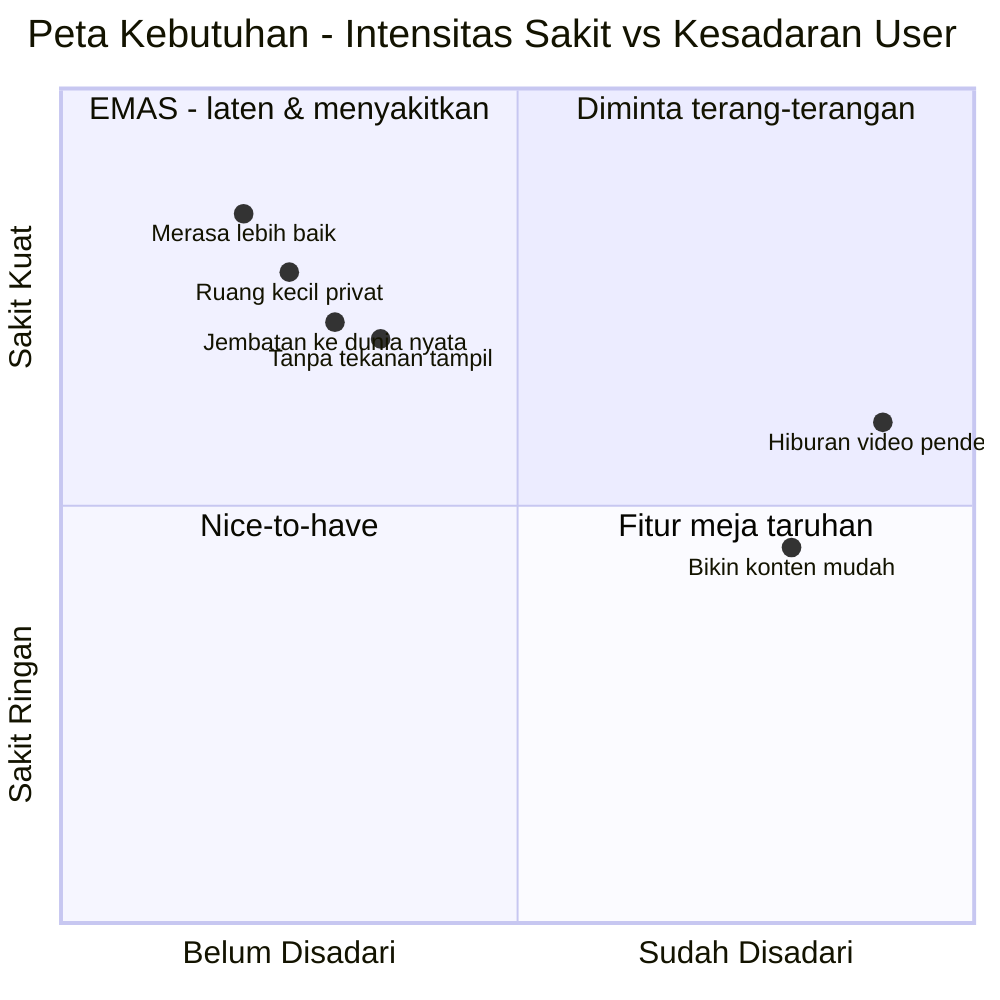

# 3. Apa yang Orang BUTUH tapi Belum Sadari (LATENT NEEDS)

[⬅️ 2. Keinginan](02-keinginan-sekarang.md) · [Indeks](README.md) · [4. Peluang ➡️](04-peluang-whitespace.md)

Bagian terpenting: hal yang orang **rasakan sakitnya**, tapi belum tahu ada produknya.

| # | Kebutuhan laten | "Sakit" yang dirasakan | Bukti / sinyal |
|---|---|---|---|
| 1 | **Merasa lebih baik** setelah scroll (*social health*) | Buka app → makin insecure/cemas | Tren detox, dumb phone, Surgeon General 2023; Bluesky dipuji "Shangri-La" |
| 2 | **Ruang kecil & privat** (*digital campfire*) | Capek "tampil" di panggung publik | HBR "Antisocial Social Media" (2020); grup chat; Fizz (kampus) |
| 3 | **Jembatan ke dunia nyata** | Ribuan follower tapi kesepian | Partiful (acara), Jagat (lokasi, 10 jt+ di SEA) |
| 4 | **Dilihat tanpa tekanan sempurna** | Takut posting karena harus "estetik" | BeReal, Dispo (kamera jadul), Made With Friends |
| 5 | **Ditemani & didengar tanpa dihakimi** | Butuh curhat/teman kapan saja | Character.ai 3,5 jt/hari, mayoritas 16–30 ⚠️ |
| 6 | **Ekspresi diri & identitas** | Profil generik, terasa "bukan gue" | Noplace (nostalgia MySpace, kustomisasi) |
| 7 | **Kontrol atas algoritma** | Merasa "dikendalikan" feed | Bluesky: pilih algoritma sendiri, anti-toxicity, tanpa iklan |
| 8 | **Menemukan "orang gue"** | Susah nemu komunitas seminat | Reddit/Discord/RedNote (minat > follow) |
| 9 | **Waktu yang berarti** (anti-doomscroll) | Nyesel habis 2 jam nge-scroll | Gerakan "time well spent" |

> ⚠️ **Peringatan #5 (AI companion):** permintaannya besar, tapi Character.ai menghadapi **gugatan serius & larangan pengguna <18 (Nov 2025)** terkait keselamatan. Jika menyentuh area ini, **keamanan & etika wajib jadi fondasi**, bukan tambahan.

