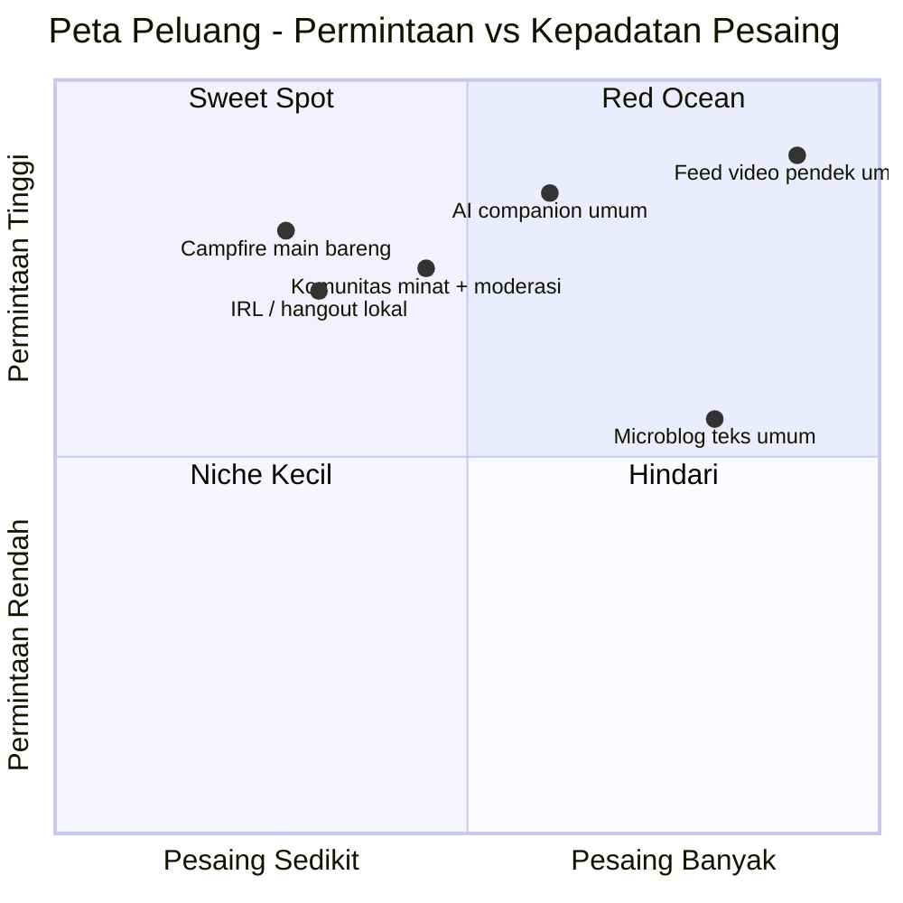

# 4. Peluang / Whitespace

[⬅️ 3. Latent Needs](03-latent-needs.md) · [Indeks](README.md) · [5. Rekomendasi ➡️](05-rekomendasi.md)

## Pelajaran dari pemain baru
**Bluesky** tumbuh 30 jt (Jan 2025) → 45 jt+ (2026) karena orang kabur dari X — **tapi** DAU-nya **turun** (2,5 jt Mar → 1,5 jt Sep 2025) dan dikritik sebagai "echo chamber".

👉 **Migrasi ≠ retensi.** Yang bikin lengket adalah **vibe, kebiasaan, dan komunitas** — bukan sekadar "anti-platform lama".

Pemain baru lain membuktikan celah niche: **Partiful** (acara), **Jagat** (lokasi), **Noplace** (ekspresi diri), **Dispo/BeReal** (anti-perfeksi), **Fizz** (komunitas kampus), **RedNote** (minat + lifestyle). Kesimpulan Exploding Topics: mereka menang dengan *"melayani niche & memenuhi kebutuhan yang belum terpenuhi."*

## Ruang kosong paling menjanjikan
- **"Campfire yang fun"** — grup kecil, santai, playful (game/prompt) yang **menaikkan mood** = keaslian + belonging + social health.
- **IRL-bridge lokal** (cocok Indonesia) — online→offline: hangout, acara, berbasis lokasi/kampus/kota.
- **Komunitas minat playful** dengan **moderasi & manajemen vibe** yang kuat.
- **Kreasi super-mudah + remix/kolaboratif** — mesin pertumbuhan alami (à la duet TikTok).
- **"Time well spent"** sebagai diferensiasi terang-terangan.

