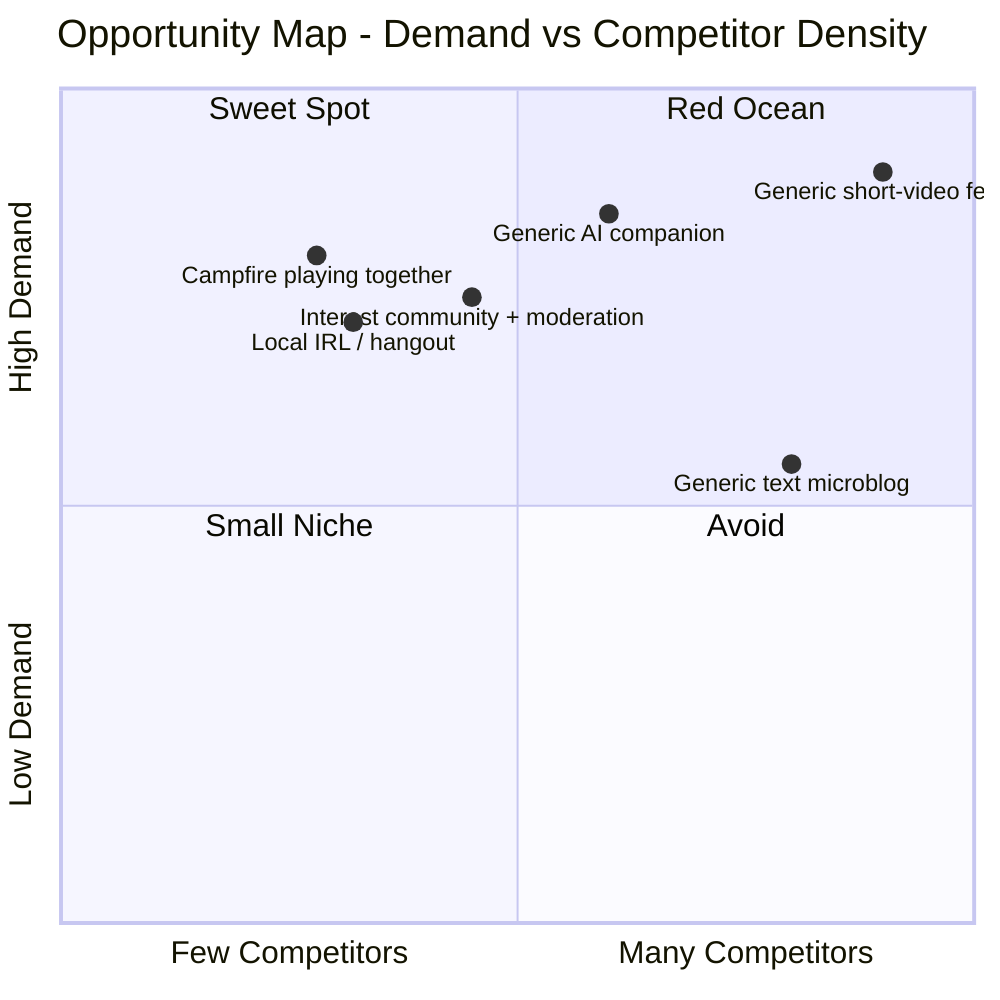

# 4. Opportunity / Whitespace

[⬅️ 3. Latent Needs](03-latent-needs.md) · [Index](README.md) · [5. Recommendations ➡️](05-rekomendasi.md)

## Lessons from new players

**Bluesky** grew from 30M (Jan 2025) → 45M+ (2026) as people fled X — **but** its DAU **fell** (2.5M Mar → 1.5M Sep 2025) and it was criticized as an "echo chamber".

👉 **Migration ≠ retention.** What makes something sticky is **vibe, habit, and community** — not just being "anti the old platform".

> **Note:** the **"generic AI companion"** quadrant in the map below is one we deliberately **avoid**. We play in its *sweet spot*: campfire, local IRL, interest communities.

Other new players prove the niche gap: **Partiful** (events), **Jagat** (location), **Noplace** (self-expression), **Dispo/BeReal** (anti-perfection), **Fizz** (campus community), **RedNote** (interest + lifestyle). Exploding Topics' conclusion: they win by *"serving a niche & meeting an unmet need."*

## The most promising open space

- **"A fun campfire"** — small, relaxed, playful groups (games/prompts) that **lift your mood** = authenticity + belonging + social health.
- **Local IRL-bridge** (a fit for Indonesia) — online→offline: hangouts, events, location/campus/city based.
- **Playful interest communities** with strong **moderation & vibe management**.
- **Super-easy creation + remix/collaborative** — a natural growth engine (à la TikTok duet).
- **"Time well spent"** as explicit differentiation.

