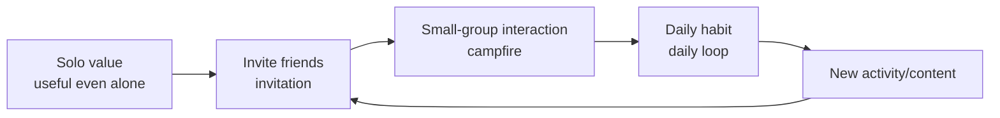
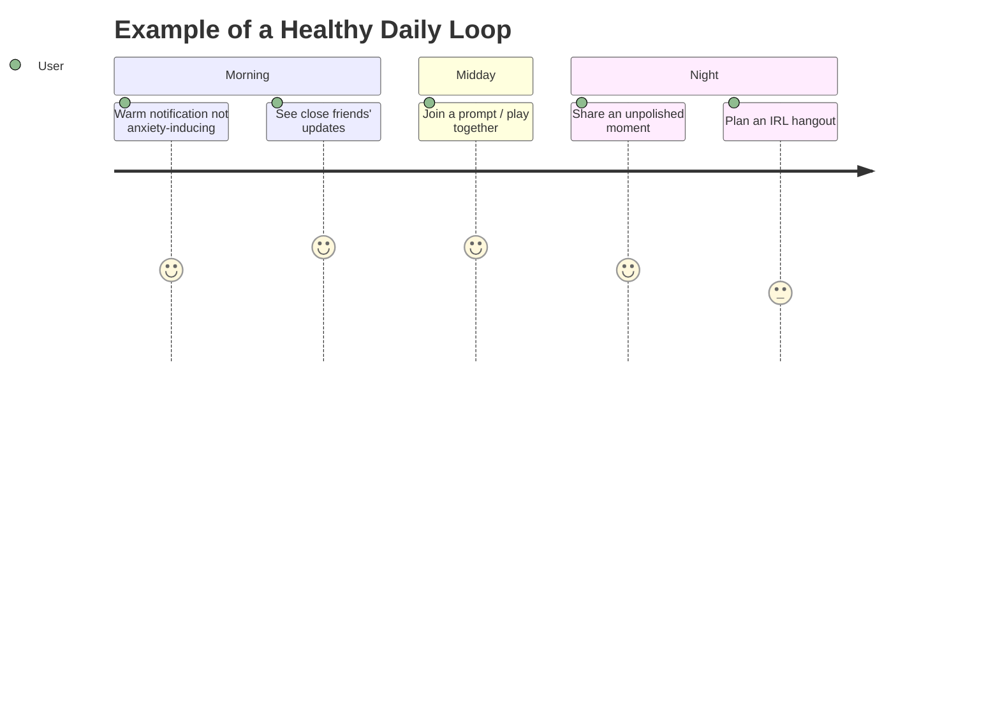
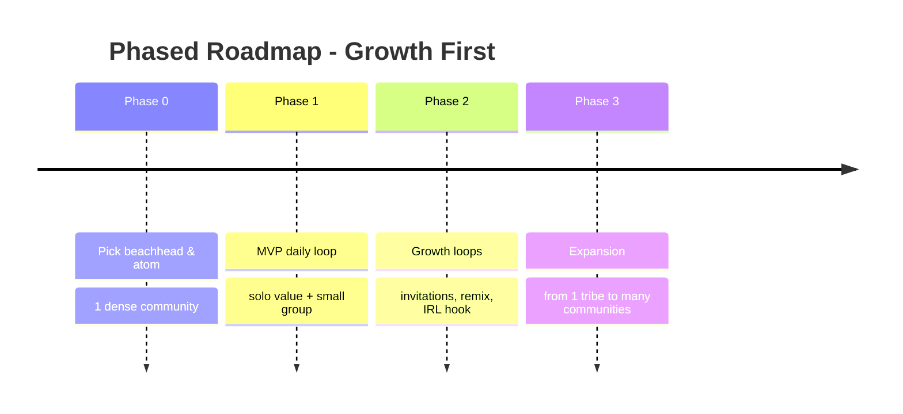

# 5. Recommendations for Your Platform

[⬅️ 4. Opportunity](04-whitespace-opportunities.md) · [Index](README.md)

> **Update 11 August 2026:** GPT-5.6 Sol's independent validation shifts the recommendation to **Plan-first**. This document is the early line of thinking; the latest decision is in [`../validation/`](../validation/README.md) and [`../concept/`](../concept/README.md).

Your context: *fun, for everyone, focus on finding users first.* Translated into strategy:

1. **"For everyone" = the goal, not the start.** Pick **1 beachhead** (a dense community you understand).
2. **Define the "atom"** — the core unit: a daily moment? a short clip? a play-together prompt? Pick one.
3. **Design a daily loop that lifts the mood** (*social health by design*) — success = "I feel better & connected", not "I got lots of likes".
4. **A built-in growth engine** — there's **value even when alone**, then a natural **invitation**.
5. **Tie it to the real world** (an IRL hook) — a strong differentiator and antidote to emptiness.
6. **Mobile-first & close to messaging** (Indonesia's reality).
7. **Safety & moderation from day 1** — especially if it touches young people.
8. **Human-first as differentiation.** The product is designed to be **100% human-made**; amid fatigue & "AI slop", a *human-first* approach becomes the very thing that sets it apart (see [`../concept/`](../concept/README.md)).

## Risks to watch for

- **Cold-start** (empty at first) & **retention** (not just acquisition).
- **Moderation & safety** (children, harmful content) — rely on social design + human review (see [`../concept/01-mvp-features.md`](../concept/01-mvp-features.md)).
- **Risk of being seen as "not sophisticated enough"** → make *human-first* a strength, not a weakness.

## Next steps

The beachhead is narrowed to a group of 4–12 first-year students at one founder-accessible campus; the atom is now the **Plan**, not the daily Moment. Next, run the [14-day no-app experiment](../validation/02-14-day-experiment.md).
