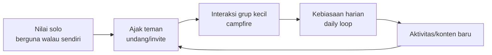
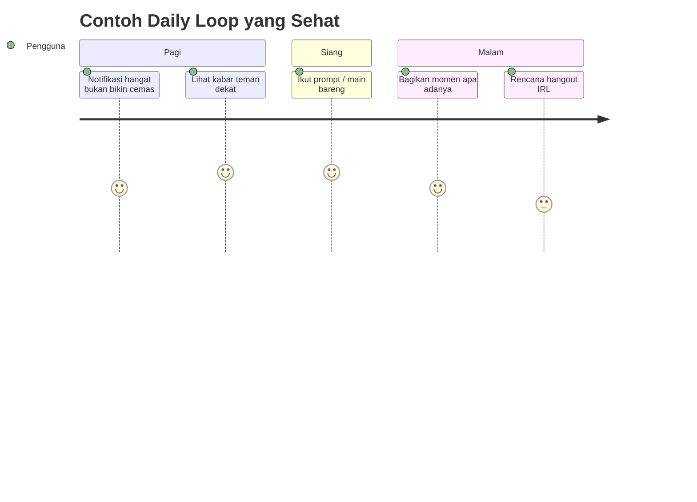
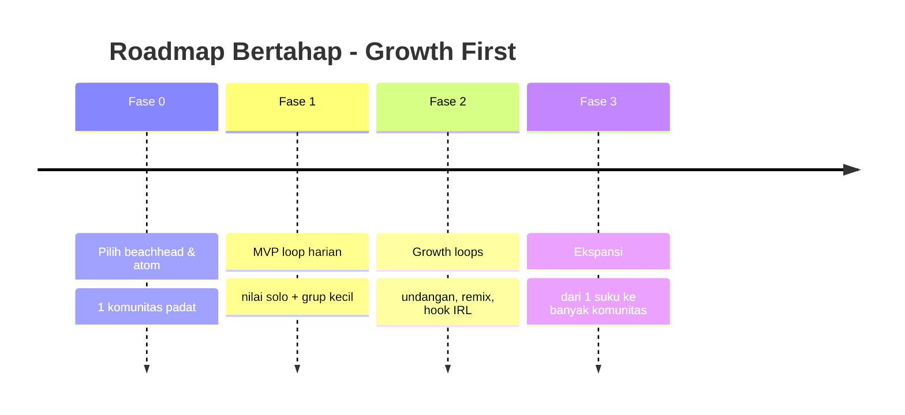

# 5. Rekomendasi untuk Platform-mu

[⬅️ 4. Peluang](04-peluang-whitespace.md) · [Indeks](README.md)

Konteksmu: *seru-seruan, buat semua orang, fokus cari user dulu.* Terjemahannya jadi strategi:

1. **"Buat semua orang" = tujuan, bukan start.** Pilih **1 beachhead** (komunitas padat yang kamu paham).
2. **Tentukan "atom"-nya** — unit inti: momen harian? klip pendek? prompt main bareng? Pilih satu.
3. **Rancang loop harian yang menaikkan mood** (*social health by design*) — sukses = "aku merasa lebih baik & terhubung", bukan "aku dapat banyak like".
4. **Mesin pertumbuhan built-in** — ada **nilai walau sendiri**, lalu **ajakan** yang natural.
5. **Kaitkan ke dunia nyata** (hook IRL) — pembeda kuat & anti-sepi.
6. **Mobile-first & dekat messaging** (realita Indonesia).
7. **Keamanan & moderasi sejak hari-1** — apalagi jika menyentuh anak muda.
8. **Keputusan sadar: TANPA AI.** Produk dirancang **100% manusia** (tanpa chatbot/feed/generasi/moderasi AI). Di tengah kelelahan & "AI slop", *human-first* justru jadi diferensiasi (lihat [`../concept/`](../concept/README.md)).

## Risiko yang harus diwaspadai
- **Cold-start** (sepi di awal) & **retensi** (bukan cuma akuisisi).
- **Moderasi & keamanan** (anak, konten berbahaya) — karena **tanpa AI moderation**, andalkan desain sosial + tinjauan manusia (lihat [`../concept/01-fitur-mvp-tanpa-ai.md`](../concept/01-fitur-mvp-tanpa-ai.md)).
- **"Tanpa AI" dianggap kurang canggih** → jadikan *human-first* sebagai kekuatan, bukan kelemahan.

## Langkah berikutnya
Beachhead + atom sudah dikunci di [`../concept/`](../concept/README.md) → **Unggun** (mahasiswa 1 kampus; atom = "Momen" harian). Berikutnya: pilih kampus percontohan + rakit prototipe *loop* harian.
