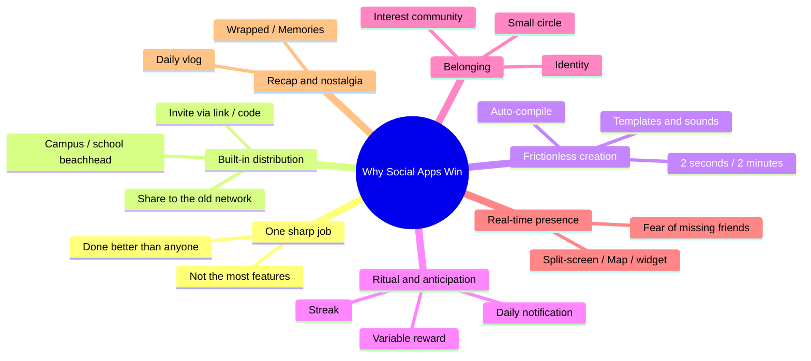

# 6. Study: Top Social Apps on the App Store — Why They Win

**Date:** 11 August 2026 · **Focus:** the ~30 top social apps, their shared winning patterns, plus case studies of **BeReal** & **setlog**.

[⬅️ 5. Recommendations](05-rekomendasi.md) · [Index](README.md)

## Executive Summary (TL;DR)

- **The winners aren't the ones with the most features, but the ones with one sharp "job"** they do better than anyone (TikTok = passive entertainment; WhatsApp = reliable messaging; Reddit = interest communities; BeReal = honest daily check-in).
- **A repeating winning pattern:** one sharp job → *network effect* → a distribution door (share/invite) → nearly frictionless content creation → **ritual + anticipation** → belonging/identity → real-time presence → recap/nostalgia.
- **The new wave (BeReal, setlog, Locket)** wins precisely with a **small circle + authenticity + ritual**, not a giant public feed. This is exactly the **Unggun** concept's lane.
- **setlog** (viral in Korea & Hong Kong, **1M+ downloads**) is almost identical to the Unggun hypothesis: **groups of ≤12 people**, real-time moments, and an **automatic daily recap**. Strong validation that the "small circle" loop is real and can grow.
- **BeReal** proved a daily ritual can explode (21.6M → 73.5M users in a month) **but can also wither** without utility/a reason to stay. An important retention lesson for us.

## Methodology & an honest note

- The "top" ranking in the **Social Networking / Communication** category on the App Store **changes daily** and **differs by country**. The list below is a **representative composite**: chart regulars + roughly ordered by **download scale** ([Business of Apps 2026](https://www.businessofapps.com/data/most-popular-apps/) data, sourced from Appfigures & AppMagic) and prominence.
- The download figures cited = **global 2025 downloads** (millions), only for those with available data. The rest are described qualitatively.
- The **BeReal** case study is sourced from [Wikipedia](https://en.wikipedia.org/wiki/BeReal) (cross-verified against Verge, TechCrunch, FT). **setlog** from [CyberLink](https://www.cyberlink.com/blog/app-video-editing/5527/what-is-setlog-app) & [Google Play](https://play.google.com/store/apps/details?id=com.newchat.setlog).

## A. Top social categories by downloads (2025)

Global 2025 downloads, in millions — the **Social** category per Business of Apps.

| # | App | 2025 downloads (M) | Core job / why it wins |
| --- | --- | --- | --- |
| 1 | TikTok | 644 | Endless *lean-back* entertainment; algorithmic FYP + sounds/templates make content easy |
| 2 | Instagram | 521 | Visual networking + status; Reels/Stories; a giant social graph |
| 3 | Facebook | 431 | The widest graph + Groups + Marketplace; all-in-one utility |
| 4 | WhatsApp | 405 | Free, reliable, universal messaging — becomes social *infrastructure* |
| 5 | Telegram | 297 | Large groups + broadcast channels + privacy perception |
| 6 | Snapchat | 275 | Ephemeral messaging, streaks, camera-first, Map, *close friends* |
| 7 | Threads | 274 | Text micro-blog; pulled up fast by Instagram's graph |
| 8 | Pinterest | 195 | Visual boards for intent & plans; low drama |
| 9 | Messenger | 193 | The chat door from Facebook's graph |
| 10 | X (Twitter) | 123 | Real-time public conversation & news |

> Important context: the **most-downloaded app overall in 2025 was ChatGPT (770M)** — AI assistants now dominate the top of the download charts. That means the "social-human" lane (small circles, authenticity, IRL) is increasingly a distinctive space not fought over by the feed giants.

## B. ~30 regulars of the App Store social chart (composite)

Grouped by **archetype**, roughly ordered by scale/prominence. Live ranks shift daily; some (WeChat, LINE, RedNote) are dominant per-region.

| # | App | Archetype | Why it wins (core mechanic) |
| --- | --- | --- | --- |
| 1 | TikTok | Short video | Algorithmic FYP + nearly frictionless creation |
| 2 | Instagram | Photo/Reels/Stories | Visual status + a giant graph |
| 3 | WhatsApp | Messaging | Free, reliable, universal |
| 4 | Facebook | All-in-one network | Graph + Groups + Marketplace |
| 5 | Messenger | Messaging | Chat from Facebook's graph |
| 6 | Telegram | Messaging + channels | Large groups & broadcast |
| 7 | Snapchat | Ephemeral messaging | Auto-disappearing, streaks, camera-first |
| 8 | WeChat | Super-app | Chat + pay + mini-programs (1B+ users, China) |
| 9 | LINE | Messaging super-app | Dominant in Japan/Thailand/Taiwan; stickers + wallet |
| 10 | X (Twitter) | Micro-blog | Real-time public conversation |
| 11 | Threads | Micro-blog | Lightweight text, pulled up by Instagram's graph |
| 12 | Pinterest | Visual boards | Intent/plans + shopping inspiration |
| 13 | Reddit | Interest communities | Pseudonymity + upvotes + "my people" |
| 14 | Discord | Community servers | Real-time voice/text for interests & gaming |
| 15 | RedNote (Xiaohongshu) | Lifestyle + interest + shopping | UGC reviews + community |
| 16 | Lemon8 | Lifestyle catalog | Aesthetic photos + tips (ByteDance) |
| 17 | LinkedIn | Professional network | Career identity + utility |
| 18 | Likee | Short video | Strong in emerging markets |
| 19 | Bluesky | Decentralized micro-blog | An X alternative, algorithm control |
| 20 | Tumblr | Interest/fandom blog | Expression + subculture |
| 21 | Yubo | Teen *live social* | Meeting new people via live + swipe |
| 22 | BAND | Organized groups | Communities/clubs + scheduling |
| 23 | Nextdoor | Neighbors/local | Hyperlocal utility |
| 24 | Signal | Privacy messaging | Encryption + trust |
| 25 | Partiful | Event invitations | IRL coordination: link + RSVP ("plans that happen" lane) |
| 26 | BeReal | Authentic daily check-in | 2-minute ritual, dual-cam, *friends not followers* |
| 27 | setlog | Micro-vlog circle of ≤12 | 2-sec clip/hour, real-time split-screen, daily recap |
| 28 | Locket Widget | Photos to a close circle | *Ambient* presence on the home screen |
| 29 | NGL / Sendit | Anonymous Q&A | Curiosity + prompts (Instagram add-on) |
| 30 | Noplace | Profile + real-time text | MySpace nostalgia, anti-algorithm; briefly went viral to the top of the US social App Store (2024) |

## C. Cross-app winning patterns (why they all succeed)

1. **One sharp job.** Every winner has *one* sentence: "the app for ___". The blurry ones die.
2. **Distribution baked into the action.** The content *wants to be shared* (TikTok videos, BeReal/setlog invite codes, Partiful RSVPs). Growth is built-in, not ads.
3. **Nearly frictionless creation.** TikTok gives sounds+templates; setlog is just 2 seconds then auto-compiles; BeReal is 2 taps. The easier it is to make, the more people make.
4. **Ritual + anticipation (variable reward).** BeReal (a random daily window, like Wordle), setlog (an hourly ping), Snapchat (streaks), TikTok (an unpredictable FYP). There's **a reason to open it every day**.
5. **Belonging & identity.** Reddit/Discord (communities), RedNote/Lemon8 (interests), Locket/BeReal/setlog (small circles). People come to *be part of something*.
6. **Real-time presence + friend FOMO.** Snap Map, BeReal's simultaneity, setlog's live split-screen, the Locket widget — "what are my friends doing **right now**".
7. **Recap & nostalgia.** Spotify Wrapped, setlog's daily vlog, BeReal's Memories — a repackaged past brings people back.
8. **A closed circle lowers the pressure to perform.** The new wave wins because it's **small & private** — the opposite of the tiring public feed.
9. **Young beachhead → spread.** Facebook (Harvard), BeReal (campus + paid ambassadors), Fizz (campus), setlog (Korean teens). Start from a dense network, then expand.

## D. Case studies

### D1. BeReal — an explosive ritual, fragile retention

- **Mechanic:** once a day, a random notification → a **2-minute** window to shoot with the **front + back cameras** at once, **no filter/edit**, **no follower count**. Interaction is via **RealMoji** (reaction photos), not likes. *Friends, not followers*.
- **Explosion:** released in 2020, went viral in early 2022 via **campuses** + a **paid ambassador** program. Users went **21.6M → 73.5M** between July–August 2022. Peak **~10M DAU / 21.6M MAU** (Aug 2022), then **47.8M MAU / 13M DAU** (Feb 2023). **#1 free on the App Store** (Jul–Sep 2022) & **iPhone App of the Year 2022**.
- **Wither:** DAU fell **~15M (Oct 2022) → ~6M (spring 2023)**, down to **~23M users** by early 2024. **Acquired by Voodoo for €500M (June 2024)**, the founders stepped down.
- **Positioning:** *anti-Instagram*, deliberately reducing **social media fatigue**; "perfection is the enemy of happiness". Compared to **Wordle** for its daily ritual cycle.
- **Criticism/lessons:** allowing late posts → authenticity weakened; a ritual without **utility/real outcomes** → burnout; hard to grow after the peak. **Lesson for Unggun: a ritual draws people in, but what keeps them is concrete value** (in our case: meetups that actually happen).

### D2. setlog (셋로그) — a "campfire" already running in Asia

- **What it is:** a social micro-vlog (dev **newchat**; App Store *setlog: friends camera*, Google Play `com.newchat.setlog`, **Social** category, **1M+ downloads**, ~4.5K reviews). Went viral in **Korea & Hong Kong** via TikTok/IG.
- **Mechanic:** create/join a **"Log"** (group) via an **invite code**, **max 12 members**. Every hour there's a reminder to record a **~2-second live clip** (landscape, **not allowed** from the gallery, can't backfill a past hour). Clips update **in real time on a split-screen**; you can **comment + emoji-react**. At day's end it **automatically becomes a mini-vlog** you can export; **swipe** to see old Logs (*throwback*).
- **Why it went viral:** authentic "daily life", minimalist aesthetics, real-time; **"the fun is recording together with friends & peeking at each other's day"** — that's the main engine. It rode the TikTok/IG editing trend.
- **Weaknesses:** no built-in music, limited customization, can't upload old recordings, some complaints about layout changes (~3.7★ reviews).

> **Why this matters for us:** setlog = **a circle of ≤12 + real-time moments + a daily recap**. That's **three of Unggun's four pillars**, already proven to have early *product-market fit* in Asia. What setlog/BeReal **don't** have: the **"plans that happen" wedge (coordinating IRL meetups)** à la Partiful. That's where Unggun's gap is.

## E. So what do people actually love?

| What they love | Evidence from apps | How Unggun answers it |
| --- | --- | --- |
| **Belonging / a small circle** | setlog ≤12, Locket, BeReal *friends* | A circle of 4–12 people, private invitations |
| **Authenticity without the pressure to perform** | BeReal no-filter, setlog live-only | Unpolished moments, no public followers/likes |
| **Ritual & anticipation** | BeReal daily, setlog hourly, streaks | Light prompts & streaks, not an obligation |
| **Real-time presence** | Snap Map, setlog split-screen, Locket | Circle moments + a "what's up" status |
| **Play & having fun** | Snap filters, social games | Playing together ("most likely to…") |
| **Memories & nostalgia** | Wrapped, daily vlog, Memories | Private recap & throwback |
| **Real usefulness / coordination** | Partiful, WhatsApp | **"Plans That Happen"** — real IRL meetups |

**Conclusion:** people love **a warm small circle, a ritual that brings them back, authenticity without a stage, and friends' presence in real time** — and it gets stickier when there's a **real outcome** (meetups, memories). setlog & BeReal have already proven the first four drives; Unggun's differentiating strength is adding **IRL coordination utility** on top — exactly the lane no player has locked down yet.

## Sources

- Business of Apps — Most Popular Apps (2026), updated 24 Mar 2026 (Appfigures & AppMagic data): [businessofapps.com/data/most-popular-apps](https://www.businessofapps.com/data/most-popular-apps/)
- Wikipedia — BeReal (history, mechanics, Voodoo €500M acquisition): [en.wikipedia.org/wiki/BeReal](https://en.wikipedia.org/wiki/BeReal)
- CyberLink — "What is Setlog?" (mechanics & features, Korea/Hong Kong trend): [cyberlink.com/blog/app-video-editing/5527/what-is-setlog-app](https://www.cyberlink.com/blog/app-video-editing/5527/what-is-setlog-app)
- Google Play — setlog by newchat (Social category, 1M+ downloads): [play.google.com/store/apps/details?id=com.newchat.setlog](https://play.google.com/store/apps/details?id=com.newchat.setlog)
- App Store — setlog: friends camera (id 6587576438).
