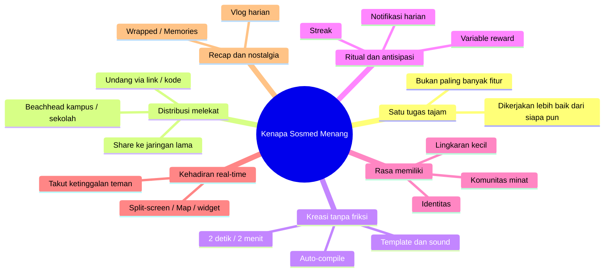

# 6. Studi: Sosmed Teratas App Store — Kenapa Mereka Menang

**Tanggal:** 11 Agustus 2026 · **Fokus:** ~30 aplikasi sosial teratas, pola kemenangan bersama, plus studi kasus **BeReal** & **setlog**.

[⬅️ 5. Rekomendasi](05-rekomendasi.md) · [Indeks](README.md)

## Ringkasan Eksekutif (TL;DR)

- **Yang menang bukan yang paling ramai fitur, tapi yang punya satu "tugas" tajam** yang dikerjakan lebih baik dari siapa pun (TikTok = hiburan pasif; WhatsApp = pesan andal; Reddit = komunitas minat; BeReal = check-in jujur harian).
- **Pola kemenangan berulang:** satu tugas tajam → *network effect* → pintu distribusi (share/undang) → penciptaan konten nyaris tanpa friksi → **ritual + antisipasi** → rasa memiliki/identitas → kehadiran real-time → recap/nostalgia.
- **Gelombang baru (BeReal, setlog, Locket)** menang justru dengan **lingkaran kecil + keaslian + ritual**, bukan feed publik raksasa. Ini persis lajur konsep **Unggun**.
- **setlog** (viral di Korea & Hong Kong, **1 jt+ unduhan**) hampir identik dengan hipotesis Unggun: **grup ≤12 orang**, momen real-time, dan **recap harian otomatis**. Validasi kuat bahwa loop "lingkaran kecil" nyata dan bisa tumbuh.
- **BeReal** membuktikan ritual harian bisa meledak (21,6 jt → 73,5 jt pengguna dalam sebulan) **tapi juga bisa layu** kalau tidak ada utilitas/alasan bertahan. Pelajaran retensi penting untuk kita.

## Metodologi & catatan jujur

- Peringkat "top" kategori **Social Networking / Communication** di App Store **berubah tiap hari** dan **berbeda per negara**. Daftar di bawah adalah **komposit representatif**: penghuni tetap chart + diurut kira-kira berdasarkan **skala unduhan** (data [Business of Apps 2026](https://www.businessofapps.com/data/most-popular-apps/), sumber Appfigures & AppMagic) dan prominensi.
- Angka unduhan yang dikutip = **unduhan global 2025** (juta), khusus untuk yang ada datanya. Sisanya dideskripsikan kualitatif.
- Studi kasus **BeReal** bersumber dari [Wikipedia](https://en.wikipedia.org/wiki/BeReal) (terverifikasi silang ke Verge, TechCrunch, FT). **setlog** dari [CyberLink](https://www.cyberlink.com/blog/app-video-editing/5527/what-is-setlog-app) & [Google Play](https://play.google.com/store/apps/details?id=com.newchat.setlog).

## A. Kategori sosial teratas berdasarkan unduhan (2025)

Unduhan global 2025, dalam juta — kategori **Social** menurut Business of Apps.

| # | App | Unduhan 2025 (jt) | Tugas inti / kenapa menang |
| --- | --- | --- | --- |
| 1 | TikTok | 644 | Hiburan *lean-back* tanpa henti; FYP algoritmik + sound/template bikin konten gampang |
| 2 | Instagram | 521 | Jejaring visual + status; Reels/Stories; graf sosial raksasa |
| 3 | Facebook | 431 | Graf terluas + Grup + Marketplace; utilitas serba-ada |
| 4 | WhatsApp | 405 | Pesan gratis, andal, universal — jadi *infrastruktur* sosial |
| 5 | Telegram | 297 | Grup besar + channel broadcast + persepsi privasi |
| 6 | Snapchat | 275 | Pesan efemeral, streak, kamera-first, Map, *close friends* |
| 7 | Threads | 274 | Micro-blog teks; ditarik cepat oleh graf Instagram |
| 8 | Pinterest | 195 | Papan visual untuk niat & rencana; rendah drama |
| 9 | Messenger | 193 | Pintu chat dari graf Facebook |
| 10 | X (Twitter) | 123 | Percakapan & berita publik real-time |

> Konteks penting: aplikasi **paling banyak diunduh 2025 secara keseluruhan adalah ChatGPT (770 jt)** — asisten AI kini mendominasi puncak unduhan. Artinya lajur "sosial-manusia" (lingkaran kecil, keaslian, IRL) justru makin jadi ruang yang khas dan tidak ramai-ramai diperebutkan raksasa feed.

## B. ~30 penghuni tetap chart sosial App Store (komposit)

Dikelompokkan per **arketipe**, diurut kira-kira per skala/prominensi. Live rank bergeser tiap hari; sebagian (WeChat, LINE, RedNote) dominan per-region.

| # | App | Arketipe | Kenapa menang (mekanik inti) |
| --- | --- | --- | --- |
| 1 | TikTok | Video pendek | FYP algoritmik + kreasi nyaris tanpa friksi |
| 2 | Instagram | Foto/Reels/Stories | Status visual + graf raksasa |
| 3 | WhatsApp | Pesan | Gratis, andal, universal |
| 4 | Facebook | Jejaring serba-ada | Graf + Grup + Marketplace |
| 5 | Messenger | Pesan | Chat dari graf Facebook |
| 6 | Telegram | Pesan + channel | Grup besar & broadcast |
| 7 | Snapchat | Pesan efemeral | Hilang otomatis, streak, kamera-first |
| 8 | WeChat | Super-app | Chat + bayar + mini-program (1 M+ pengguna, China) |
| 9 | LINE | Super-app pesan | Dominan Jepang/Thailand/Taiwan; stiker + dompet |
| 10 | X (Twitter) | Micro-blog | Percakapan publik real-time |
| 11 | Threads | Micro-blog | Teks ringan, ditarik graf Instagram |
| 12 | Pinterest | Papan visual | Niat/rencana + inspirasi belanja |
| 13 | Reddit | Komunitas minat | Pseudonim + upvote + "orang gue" |
| 14 | Discord | Server komunitas | Voice/teks real-time untuk minat & gaming |
| 15 | RedNote (Xiaohongshu) | Lifestyle + minat + belanja | UGC review + komunitas |
| 16 | Lemon8 | Katalog lifestyle | Foto estetik + tips (ByteDance) |
| 17 | LinkedIn | Jejaring profesional | Identitas karier + utilitas |
| 18 | Likee | Video pendek | Kuat di pasar berkembang |
| 19 | Bluesky | Micro-blog terdesentralisasi | Alternatif X, kontrol algoritma |
| 20 | Tumblr | Blog minat/fandom | Ekspresi + subkultur |
| 21 | Yubo | *Live social* remaja | Kenalan baru via live + swipe |
| 22 | BAND | Grup terorganisir | Komunitas/klub + jadwal |
| 23 | Nextdoor | Tetangga/lokal | Utilitas hyperlocal |
| 24 | Signal | Pesan privasi | Enkripsi + kepercayaan |
| 25 | Partiful | Undangan acara | Koordinasi IRL: link + RSVP (lajur "rencana jadi") |
| 26 | BeReal | Check-in harian autentik | Ritual 2 menit, dual-cam, *friends not followers* |
| 27 | setlog | Micro-vlog lingkaran ≤12 | Clip 2 dtk/jam, split-screen real-time, recap harian |
| 28 | Locket Widget | Foto ke lingkaran dekat | Kehadiran *ambient* di home screen |
| 29 | NGL / Sendit | Q&A anonim | Rasa penasaran + prompt (add-on Instagram) |
| 30 | Noplace | Profil + teks real-time | Nostalgia MySpace, anti-algoritma; sempat viral naik puncak sosial App Store AS (2024) |

## C. Pola kemenangan lintas app (kenapa mereka semua berhasil)

1. **Satu tugas tajam.** Setiap pemenang punya *satu* kalimat: "app untuk ___". Yang kabur mati.
2. **Distribusi melekat pada aksi.** Kontennya *ingin dibagikan* (video TikTok, kode undang BeReal/setlog, RSVP Partiful). Pertumbuhan built-in, bukan iklan.
3. **Kreasi nyaris tanpa friksi.** TikTok kasih sound+template; setlog cuma 2 detik lalu auto-compile; BeReal 2 ketuk. Makin mudah bikin, makin banyak yang bikin.
4. **Ritual + antisipasi (variable reward).** BeReal (jendela acak harian, mirip Wordle), setlog (ping tiap jam), Snapchat (streak), TikTok (FYP tak terduga). Ada **alasan membuka tiap hari**.
5. **Rasa memiliki & identitas.** Reddit/Discord (komunitas), RedNote/Lemon8 (minat), Locket/BeReal/setlog (lingkaran kecil). Orang datang untuk *jadi bagian dari sesuatu*.
6. **Kehadiran real-time + FOMO teman.** Snap Map, simultanitas BeReal, split-screen live setlog, widget Locket — "apa yang lagi dilakukan teman gue **sekarang**".
7. **Recap & nostalgia.** Spotify Wrapped, vlog harian setlog, Memories BeReal — masa lalu yang dikemas ulang bikin balik lagi.
8. **Lingkaran tertutup menurunkan tekanan tampil.** Gelombang baru menang karena **kecil & privat** — kebalikan feed publik yang bikin lelah.
9. **Beachhead muda → menyebar.** Facebook (Harvard), BeReal (kampus + duta berbayar), Fizz (kampus), setlog (remaja Korea). Mulai dari jaringan padat, lalu meluas.

## D. Studi kasus

### D1. BeReal — ritual meledak, retensi rapuh

- **Mekanik:** sekali sehari, notifikasi acak → jendela **2 menit** memotret pakai **kamera depan + belakang** sekaligus, **tanpa filter/edit**, **tanpa follower count**. Interaksi lewat **RealMoji** (foto reaksi), bukan like. *Friends, not followers*.
- **Ledakan:** rilis 2020, viral awal-2022 lewat **kampus** + program **duta berbayar**. Pengguna **21,6 jt → 73,5 jt** antara Juli–Agustus 2022. Puncak **~10 jt DAU / 21,6 jt MAU** (Agu 2022), lalu **47,8 jt MAU / 13 jt DAU** (Feb 2023). **#1 gratis App Store** (Jul–Sep 2022) & **iPhone App of the Year 2022**.
- **Layu:** DAU turun **~15 jt (Okt 2022) → ~6 jt (musim semi 2023)**, tinggal **~23 jt pengguna** awal 2024. **Diakuisisi Voodoo €500 jt (Juni 2024)**, pendiri mundur.
- **Positioning:** *anti-Instagram*, sengaja mengurangi **kelelahan sosmed**; "perfection is the enemy of happiness". Dibandingkan **Wordle** karena siklus ritual harian.
- **Kritik/pelajaran:** boleh telat posting → keaslian melemah; ritual tanpa **utilitas/hasil nyata** → kejenuhan; sulit tumbuh setelah puncak. **Pelajaran untuk Unggun: ritual menarik orang masuk, tapi yang menahan mereka bertahan adalah nilai konkret** (di kasus kita: pertemuan yang benar-benar terjadi).

### D2. setlog (셋로그) — "campfire" yang sudah jalan di Asia

- **Apa:** micro-vlog sosial (dev **newchat**; App Store *setlog: friends camera*, Google Play `com.newchat.setlog`, kategori **Social**, **1 jt+ unduhan**, ~4,5 rb ulasan). Viral di **Korea & Hong Kong** lewat TikTok/IG.
- **Mekanik:** buat/gabung **"Log"** (grup) via **kode undang**, **maks 12 anggota**. Tiap jam ada reminder rekam **clip live ~2 detik** (landscape, **tidak boleh** dari galeri, tidak bisa isi jam yang lewat). Clip update **real-time di split-screen**; bisa **komentar + reaksi emoji**. Akhir hari **otomatis jadi mini-vlog** yang bisa diekspor; **swipe** untuk lihat Log lama (*throwback*).
- **Kenapa viral:** keaslian "daily life", estetik minimalis, real-time; **"serunya adalah merekam bareng teman & saling mengintip hari masing-masing"** — itu mesin utamanya. Naik menumpang tren editing TikTok/IG.
- **Kelemahan:** tanpa musik bawaan, kustomisasi terbatas, tak bisa unggah rekaman lama, sebagian keluhan soal perubahan layout (ulasan ~3,7★).

> **Kenapa ini penting buat kita:** setlog = **lingkaran ≤12 + momen real-time + recap harian**. Itu **tiga dari empat pilar Unggun** yang sudah terbukti punya *product-market fit* awal di Asia. Yang **belum** dimiliki setlog/BeReal: **wedge "rencana jadi" (koordinasi ketemuan IRL)** ala Partiful. Di situ celah Unggun.

## E. Jadi, apa yang sebenarnya digemari orang?

| Yang digemari | Bukti dari app | Bagaimana Unggun menjawabnya |
| --- | --- | --- |
| **Rasa memiliki / lingkaran kecil** | setlog ≤12, Locket, BeReal *friends* | Lingkaran 4–12 orang, undangan privat |
| **Keaslian tanpa tekanan tampil** | BeReal no-filter, setlog live-only | Momen apa adanya, tanpa follower/like publik |
| **Ritual & antisipasi** | BeReal harian, setlog per jam, streak | Prompt & streak ringan, bukan kewajiban |
| **Kehadiran real-time** | Snap Map, split-screen setlog, Locket | Momen circle + status "lagi apa" |
| **Bermain & bersenang-senang** | filter Snap, game sosial | Main bareng ("paling mungkin…") |
| **Kenangan & nostalgia** | Wrapped, vlog harian, Memories | Recap privat & throwback |
| **Kegunaan nyata / koordinasi** | Partiful, WhatsApp | **"Rencana Jadi"** — ketemuan IRL beneran |

**Kesimpulan:** orang menggemari **lingkaran kecil yang hangat, ritual yang bikin balik lagi, keaslian tanpa panggung, dan kehadiran teman secara real-time** — lalu makin lengket kalau ada **hasil nyata** (ketemuan, kenangan). setlog & BeReal sudah membuktikan 4 dorongan pertama; kekuatan pembeda Unggun adalah menambahkan **utilitas koordinasi IRL** di atasnya — persis lajur yang belum dikunci pemain mana pun.

## Sumber

- Business of Apps — Most Popular Apps (2026), diperbarui 24 Mar 2026 (data Appfigures & AppMagic): [businessofapps.com/data/most-popular-apps](https://www.businessofapps.com/data/most-popular-apps/)
- Wikipedia — BeReal (riwayat, mekanik, akuisisi Voodoo €500 jt): [en.wikipedia.org/wiki/BeReal](https://en.wikipedia.org/wiki/BeReal)
- CyberLink — "What is Setlog?" (mekanik & fitur, tren Korea/Hong Kong): [cyberlink.com/blog/app-video-editing/5527/what-is-setlog-app](https://www.cyberlink.com/blog/app-video-editing/5527/what-is-setlog-app)
- Google Play — setlog by newchat (kategori Social, 1 jt+ unduhan): [play.google.com/store/apps/details?id=com.newchat.setlog](https://play.google.com/store/apps/details?id=com.newchat.setlog)
- App Store — setlog: friends camera (id 6587576438).
