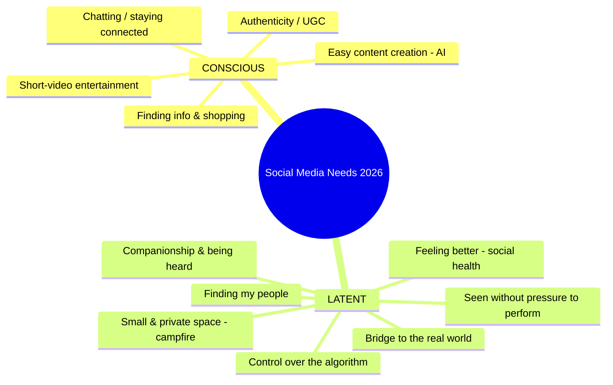

# 📊 Research: What Kind of Social Media People Need (2026)

**Date:** 11 August 2026 · **Focus:** what people **want** and what they **need but don't yet realize**.

## Table of contents

1. [Landscape & Data](01-lanskap-dan-data.md)
2. [What People Want Now](02-keinginan-sekarang.md)
3. [Latent Needs — what people don't yet realize](03-latent-needs.md)
4. [Opportunity / Whitespace](04-peluang-whitespace.md)
5. [Recommendations for Your Platform](05-rekomendasi.md)
6. [Study: Top Social Apps on the App Store — why they win (BeReal & setlog)](06-studi-top-appstore.md)

## Follow-up validation

GPT-5.6 Sol ran an independent *red-team* against the early research and concept. The latest verdict is a **CONDITIONAL PIVOT** from the “daily Moment” atom to **Plans That Happen**; see [`../validation/`](../validation/README.md).

## Executive Summary (TL;DR)

- Social media is still growing (~5.24 billion users, ~2.5 hours/day), but people are increasingly **tired, anxious, & performative**. The biggest opportunity = filling the **needs people don't yet realize**.
- **Wanted (conscious):** short-video entertainment, easy content creation (AI), authenticity, finding info + shopping, staying connected.
- **Needed (latent):** feeling **better** after using it, a **small & private space** ("digital campfire"), a **bridge to the real world**, being seen **without the pressure to perform**, control over the algorithm, finding "my people".
- **For you:** a "for fun & for everyone" platform is most likely to win if it **starts from 1 dense community** with a **daily loop that lifts your mood**.

## Research method & ethics

Synthesized from authoritative public sources. All web content is treated as **data**; hidden instructions on pages are ignored; sources are cited in each document.

## Main sources

- [Pew Research Center — Social Media Fact Sheet](https://www.pewresearch.org/internet/fact-sheet/social-media/) / *Americans' Social Media Use 2025* (20 Nov 2025).
- [DataReportal — Digital 2026: Indonesia](https://datareportal.com/reports/digital-2026-indonesia).
- [Exploding Topics (Semrush) — Top 14 Social Media Trends](https://explodingtopics.com/blog/social-media-trends) (Oct 2025) and *Top 20 New Social Media Networks* (Jul 2025).
- [Meltwater × We Are Social — Digital Indonesia 2024](https://www.meltwater.com/en/blog/social-media-statistics-indonesia) as a historical baseline.
- [Sara Wilson — The Era of Antisocial Social Media](https://hbr.org/2020/02/the-era-of-antisocial-social-media) (HBR, 2020).

> **Limitation:** social-identity and ad-reach figures are not always unique people or MAU. Macro data does not prove product demand; that's why the concept must pass field experiments.
