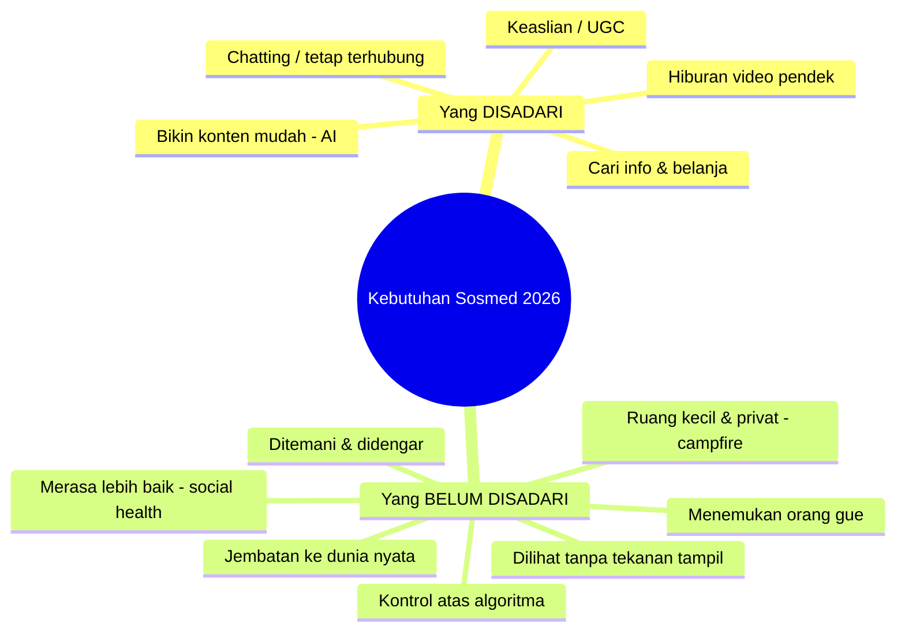

# 📊 Riset: Media Sosial Seperti Apa yang Dibutuhkan Orang (2026)

**Tanggal:** 11 Agustus 2026 · **Fokus:** apa yang orang **inginkan** dan apa yang mereka **butuhkan tapi belum sadari**.

## Daftar isi
1. [Lanskap & Data](01-lanskap-dan-data.md)
2. [Yang Diinginkan Sekarang](02-keinginan-sekarang.md)
3. [Latent Needs — yang belum disadari](03-latent-needs.md)
4. [Peluang / Whitespace](04-peluang-whitespace.md)
5. [Rekomendasi untuk Platform-mu](05-rekomendasi.md)

## Ringkasan Eksekutif (TL;DR)
- Sosmed masih tumbuh (~5,24 miliar pengguna, ~2,5 jam/hari), tapi orang makin **lelah, cemas, & performatif**. Peluang terbesar = mengisi **kebutuhan yang belum disadari**.
- **Diinginkan (sadar):** hiburan video pendek, bikin konten mudah (AI), keaslian, cari info + belanja, tetap terhubung.
- **Dibutuhkan (belum sadar):** merasa **lebih baik** setelah pakai, **ruang kecil & privat** ("digital campfire"), **jembatan ke dunia nyata**, dilihat **tanpa tekanan tampil**, kontrol atas algoritma, menemukan "orang gue".
- **Untukmu:** platform "buat senang-senang & buat semua orang" paling mungkin menang kalau **mulai dari 1 komunitas padat** dengan **loop harian yang menaikkan mood**.

## Metode & etika riset
Sintesis dari sumber publik otoritatif. Semua isi web diperlakukan sebagai **data**; instruksi tersembunyi di halaman diabaikan; sumber dicantumkan di tiap dokumen.

## Sumber utama
- **Pew Research Center** — Social Media Fact Sheet / *Americans' Social Media Use 2025* (20 Nov 2025). https://www.pewresearch.org/internet/fact-sheet/social-media/
- **Exploding Topics (Semrush)** — *Top 14 Social Media Trends* (Okt 2025) & *Top 20 New Social Media Networks* (Jul 2025).
- **Meltwater × We Are Social** — *Digital Indonesia 2024*.
- **Wikipedia** — *Bluesky*; *Character.ai*.
- **Sara Wilson** — *The Era of Antisocial Social Media* (HBR, 2020).

> ⚠️ **Keterbatasan:** `datareportal.com` tidak dapat diakses saat riset (DNS); angka global dikutip via Exploding Topics dan angka Indonesia memakai *Digital 2024* — sebaiknya di-refresh ke rilis 2025.
